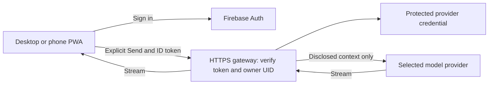

# AI access, personal hosting, companions, and mobile options

Research date: 2026-10-01. Status: investigation, not an implementation decision.

This document compares ways to make Ask Echo usable despite the current subscription-authentication difficulties. It extends the research in [chatgpt-connection.md](chatgpt-connection.md); it does not replace [PRODUCT.md](../../PRODUCT.md), authorize deployment, enable paid fallback, or change the current text/static-image scope. Provider offers and eligibility must be rechecked when selecting a route.

## Findings and suggested direction

There are three strong candidates, depending on the priority:

1. **Keep using the existing ChatGPT subscription on desktop:** validate the current local connection, then package its companion. There is a documented subscription-sharing route; successful login alone does not establish inference entitlement.
2. **Use Echo conveniently from a phone without a computer running:** a hosted PWA plus a private, single-user API gateway is the simplest architecture to investigate. Start with a free API tier using synthetic inputs, with a separately approved, budgeted paid mode if necessary. Firebase can control access, but does not provide model entitlement.
3. **Keep credentials and inference infrastructure under personal control:** a phone PWA connects over a private network to an always-on home companion. That companion can use the supported subscription connection, an API key, or a local model. Availability then depends on the home computer.

An additional promising route is a personal self-hosted VM using OpenAI's documented credential-transfer flow. Treat it as a distinct feasibility spike: personal VM support does not establish permission for a general remotely hosted service. Never embed subscription tokens in frontend code or a distributed app.

For mobile packaging, investigate **PWA first, Capacitor second**. Electron is a desktop option. Tauri 2 supports desktop and mobile but introduces a Rust/native integration layer. Packaging does not fix provider permissions or make a desktop companion run on a phone. [Electron](https://www.electronjs.org/docs/latest), [Capacitor](https://capacitorjs.com/docs), [Tauri](https://v2.tauri.app/)

These recommendations are engineering judgments from the documentation below, not measured quality or device benchmarks. No account credentials, private archive, browser cache, or live inference were accessed for this investigation.

## Separate the decisions

| Decision | Choices | What it does not solve |
| --- | --- | --- |
| Who may open/use Echo? | Local device access, Firebase allowlisted user, private network, authenticated reverse proxy | AI provider authorization |
| Who pays for inference? | Existing eligible subscription, recurring free quota, promotional credit, metered API, own hardware | Where secrets and context are processed |
| Where does the request run? | Desktop companion, home server, private VM, serverless gateway, native mobile runtime, browser model | Cross-device archive availability |
| How is the UI delivered? | Website/PWA, Electron, Tauri, Capacitor, native app | Model access, quota, or secure credential storage by itself |
| Where is the archive? | Imported independently on each device; future explicitly designed transfer/sync | Login does not sync an archive |

An agent SDK is an orchestration layer, not a free inference entitlement. Echo currently needs controlled text/image inference with no action tools; a direct model API is generally a smaller fit than a coding-agent runtime.

## Subscription and hosted-account routes

### A. Continue the official local ChatGPT connection

OpenAI documents optional ChatGPT-plan permission for open-source/local apps, distinct from identity and from access to ChatGPT conversations. Its overview distinguishes a client registration from a host and directs paid/remotely hosted app developers to a separate interest process. This is the relevant supported route to investigate, rather than treating a consumer subscription as an ordinary API key. [Plan-usage overview](https://developers.openai.com/siwc/token-sharing-open-source)

The existing connection spec records UI sign-in but leaves real-account inference, renewal/revocation, context limits, and provider handling open. It does not identify a conclusive cause for the authentication difficulties reported in this request. Do not label the route impossible or claim the bug is fixed based on this research.

Proposed diagnostic sequence, through the application with synthetic content only:

- Separate registration, browser callback, identity verification, plan permission, model availability, and terminal inference completion. An identity success or model list is insufficient.
- Check persisted host identity, user/workspace binding, refresh serialization, secure-store access, and clock/expiry handling without exposing tokens or raw provider diagnostics.
- Exercise explicit Check connection, then synthetic text and static-image turns. Distinguish permission denial, usage exhaustion, model rejection, refresh failure, and interrupted streaming in safe UI states.
- Use the documented account/model response, not a hardcoded assumption about entitlement. Keep failed or partial turns distinct from completed answers.

The plan route requires streaming and `store: false`; callers supply the necessary history. Its preview supports compatible text/image inputs but excludes audio/video inputs and several hosted tools. A wrapper cannot remove these restrictions. [Preview limitations](https://developers.openai.com/siwc/token-sharing-open-source/preview-limitations), [Models and inference](https://developers.openai.com/siwc/token-sharing-open-source/models-and-inference)

**Assessment:** smallest change for the current Linux desktop implementation. Still needs account validation. It does not make static hosting alone sufficient for authentication or mobile inference.

### B. Codex app-server companion

OpenAI documents driving app-server over stdio with an explicitly authorized ChatGPT-plan token. The application owns token renewal in that configuration; replacing the token requires restarting the child and resuming the thread. A catalog response is not proof of access. [App-server integration](https://developers.openai.com/siwc/token-sharing-open-source/codex-app-server)

**Assessment:** useful if an official runtime handles necessary protocol behavior better than our direct adapter, but adds process lifecycle, local history, and tool/configuration surfaces. Require prevention of filesystem/shell/MCP access and implicit transcript persistence. Do not enable a coding agent's default capabilities for private conversation analysis. Prefer direct inference if it meets the same gates with fewer moving parts.

### C. Personal self-hosted VM using the existing subscription

There is an official remote-VM procedure: complete OAuth locally for the same tool/user/workspace, securely transfer that registration's protected credentials, preserve a distinct VM host identity, and let the VM own subsequent refreshes. The docs warn that transferred sessions lack host-specific usage attribution and plan-access revocation. [Self-hosted VMs](https://developers.openai.com/siwc/token-sharing-open-source/self-hosted-vms)

**Candidate architecture:** private phone/desktop UI → authenticated personal gateway on the VM → authorized Responses request. Store credentials in a protected runtime store with controlled backup and rotation; investigate a suitable headless alternative to the current desktop Secret Service adapter. The documentation's credential-file procedure is not itself proof that Echo's stricter secure-store requirement is met.

This could satisfy the intent behind “hardcode my personal subscription,” while keeping the actual credential outside source and client bundles. The owner configures one account on the server. It remains refreshable/revocable, consumes that account's allowance, and cannot be assumed suitable for other users.

**Gate:** establish that the exact single-user web deployment fits the documented personal-VM route. The overview separately routes broader remote hosting through its interest process. Do not infer that Firebase authentication expands OpenAI eligibility. Do not copy another app's credential cache; only a supported transfer of this app's own registration is a candidate.

### D. Private hosted API key

**Candidate architecture:** PWA → authenticated gateway → selected model provider. A server-held API key uses that provider's developer billing/free quota, independently of ChatGPT subscription access. This avoids subscription OAuth at inference time and is a practical mobile baseline.

Use a server secret store, exact provider/model allowlists, request-size limits, concurrency limits, cancellation, and explicit cost controls. No public generic proxy or arbitrary destination URL. Serverless functions suit stateless direct API calls; a VM/container better suits persistent runtimes, credential-refresh ownership, or local models. Verify streaming, idle/request timeouts, memory limits, and region for the chosen host.

**Assessment:** strong mobile fit, but introduces another processor for each sent context and potentially ongoing cost. No server archive database is necessary. All paid access remains a proposed product decision.

### E. Other subscriptions, coding agents, and manual handoff

| Route | Assessment |
| --- | --- |
| Gemini CLI using a Google account | Official CLI quotas include an individual free allowance of up to 1,000 model requests/day, with higher subscription allowances. That is a CLI entitlement, not proof that an embedded Echo service may reuse it. Check allowed workload, noninteractive integration, tools, persistence, and model/image behavior before considering a companion adapter. [CLI quotas](https://geminicli.com/docs/resources/quota-and-pricing/), [Authentication](https://geminicli.com/docs/get-started/authentication/) |
| Claude Agent SDK / Claude subscription | An official SDK exists, but this research did not establish subscription-funded third-party Echo inference permission. Treat API-backed SDK use and consumer subscription use as separate proposals. No copied OAuth tokens or undocumented endpoints. [Agent SDK](https://code.claude.com/docs/en/agent-sdk/overview) |
| Mistral coding-plan credentials | Mistral explicitly distinguishes plan keys from developer API keys and directs API automation to developer keys. Investigate its actual API free mode instead. [Key and quota distinctions](https://help.mistral.ai/en/articles/698531-why-am-i-hitting-api-rate-limits-and-how-do-i-increase-them) |
| Other coding subscriptions / unofficial wrappers | Unverified entitlement; an OpenAI-compatible endpoint or open-source wrapper proves protocol compatibility, not permission, privacy, or billing. No implementation recommendation without an official integration contract. |
| Manual copy/share to ChatGPT or another provider's app | Viable low-integration fallback: user explicitly exports/copies the disclosed context and opens their chosen app. Mobile share-sheet support would require testing. Costs and limits follow that app. Loses integrated streaming, structured source citations, and reliable discussion round-tripping; clipboard/downloads become additional sensitive copies. |
| ChatGPT plugin / MCP | Changes the product to a ChatGPT-hosted discussion. Expose at most a frozen, explicitly shared context, not a browsable archive. Requires a separate tool/consent design; plugin authentication does not give Echo a general inference credential. See the existing connection spec and [plugin authentication](https://developers.openai.com/plugins/build/auth). |
| Browser automation, scraped session cookies, borrowed client IDs | Exclude from the product plan. Fragile and no established supported authorization contract; personal-only hosting does not cure those issues. |

## Free APIs, credits, and low-cost candidates

“Free” may mean a recurring quota, a small monthly credit, an evaluation-only key, or a one-time promotion. None guarantees permanent availability. Limits can be on requests, input/output throughput, daily tokens, context size, or concurrent calls. Long conversation history can exhaust a free tier even with very few questions.

| Provider / route | Verified offer or status | Fit for Echo / remaining gate |
| --- | --- | --- |
| **GroqCloud** | Documented Free plan with per-model limits; organization dashboard is authoritative. [Limits](https://console.groq.com/docs/rate-limits) | Leading synthetic prototype candidate. Select a model with the needed text/image support and effective context budget. Default inference retention has exceptions; Groq documents ZDR controls available to all customers. Verify those settings, training terms, and processing region before real use. [Data handling](https://console.groq.com/docs/your-data) |
| **Gemini Developer API** | Selected models have free pricing tiers; availability differs by model. [Pricing](https://ai.google.dev/gemini-api/docs/pricing) | Strong multimodal candidate, but region and use restrictions materially affect this proposal; see the next paragraph. Do not promise a free personal production service. |
| **Cloudflare Workers AI** | 10,000 neurons/day free allocation; some models require paid billing. Neurons are model-dependent compute units, not messages. [Pricing](https://developers.cloudflare.com/workers-ai/platform/pricing/) | Convenient gateway/inference combination. Confirm a free-eligible text/image model, context capacity, data policy, and the separate Worker limits. A free allowance is not a guarantee that every model costs zero. |
| **Mistral Studio Free mode** | Free mode is for testing/prototyping with lower organization-level limits. [Limits](https://help.mistral.ai/en/articles/698531-why-am-i-hitting-api-rate-limits-and-how-do-i-increase-them) | Useful evaluation candidate. Free-mode inputs/outputs may be used for training, with an opt-out documented. Verify the actual opt-out and retention before private use. [Data controls](https://help.mistral.ai/en/articles/347617-do-you-use-my-user-data-to-train-your-artificial-intelligence-models) |
| **OpenRouter free model variants** | Documented free-model request ceilings, distinct from paid credit limits. Exact numeric table values were missing in the fetched page; record the actual account quota during a later UI check. [Limits](https://openrouter.ai/docs/api_reference/limits) | Broad comparison route, but both router and downstream provider matter. Pin provider/model and privacy controls; prevent undisclosed routing/fallback. Free-model availability is not a stable production guarantee. [Data collection](https://openrouter.ai/docs/guides/privacy/data-collection) |
| **Hugging Face Inference Providers** | Free accounts receive $0.10 monthly credits, explicitly subject to change; paid subscriptions have different credits. [Billing](https://huggingface.co/docs/inference-providers/main/pricing) | Small smoke-test allowance, not a plausible sustained full-context budget. Review the selected downstream provider and distinguish free model downloads from hosted compute. |
| **Cerebras Inference** | Free tier and per-model quota tables are documented; exact account limits can differ. [Limits](https://inference-docs.cerebras.ai/support/rate-limits) | Text evaluation candidate. Context and modality availability require an account/model check; older pricing documentation and newer quota pages differ, so do not promise an old advertised context window. Retention/logging review remains open. |
| **Cohere** | Free evaluation keys; documented trial allowance of 1,000 calls/month and per-model limits. Production access is a separate category. [Limits](https://docs.cohere.com/v1/docs/rate-limits), [Going live](https://docs.cohere.com/v1/docs/going-live) | Useful evaluation route; distinguish prototype access from production approval. Verify model/image support and data treatment. |
| **GitHub Models** | Retired July 30, 2026, including inference API and BYOK. [Retirement notice](https://docs.github.com/en/github-models) | Exclude; historical free-tier recommendations are obsolete. Copilot is a different service. |
| **Together, Fireworks, NVIDIA hosted trials; cloud/startup credits** | No current guaranteed offer, amount, expiry, or eligibility established in this research. | Watchlist for conditional promotions, not a zero-cost architecture. Validate card requirement, expiry, permitted models, processing terms, and post-credit billing before ranking. |
| **Metered developer APIs** | Separate commercial route, with no free-credit entitlement established here. | OpenAI, Anthropic, Google and other providers remain candidates if a small explicit budget is acceptable. Compare current model prices only after the quality/context shortlist. |

**Gemini regional caveat:** current terms restrict the developer service to professional/business development rather than consumer use, and require Paid Services when making API clients available to users in the EEA, Switzerland, or UK. They separately apply paid-service data handling to users in those regions even for unpaid quota. These are different rules: favorable data handling does not establish that a free-tier personal deployment is permitted. For a Belgium-based deployment, resolve applicability before choosing it. Elsewhere, unpaid-service training/human-review provisions also need review. [Current terms](https://ai.google.dev/gemini-api/terms)

**Firebase AI Logic** is another integration variant: official client SDKs and a proxy service for Gemini, including App Check integration. It can reduce the custom gateway work for that provider. It is not Firebase Auth, does not bypass Gemini billing/region rules, and still needs an owner-only authorization strategy and abuse controls. [Firebase AI Logic](https://firebase.google.com/docs/ai-logic)

### Evaluate cost with the actual context policy

For a metered provider, estimate each turn as `(input tokens × input rate + output tokens × output rate) / 1,000,000`, plus image, cache, tool, and hosting charges where applicable. Count all retained discussion context on every turn. Use only synthetic workloads for development measurements.

Compare short selection, overlapping surrounding windows, long full conversation, repeated follow-ups, and selected images. Record first-token latency, completion time, effective context rejection, quota consumption, quality, and failure behavior. Never narrow, summarize, or route context elsewhere silently to fit a free quota.

For any eventual paid mode, propose a visible per-turn ceiling and monthly budget, disable automatic top-ups, and fail closed when accounting is uncertain. Provider alerts may not be hard spending caps. A reliable monthly cap across gateway restarts requires a durable non-content usage ledger or enforceable provider cap; that is a separate storage decision, not permission to persist conversations.

## Companion architectures

A companion is a separately running service that owns credentials and inference transport. It can run on the same computer, on a home machine, or on a private server. Merely installing the website as a PWA does not install that service.

| Variant | Desktop | Mobile | Main tradeoff |
| --- | --- | --- | --- |
| Same-device loopback companion | Closest to current implementation | A phone's localhost is the phone, not the desktop; no ordinary PWA launch of the desktop process | Low hosting cost; install/update and OS secure-store work |
| Companion bundled in Electron/Tauri desktop | One installer; credentials outside renderer | Desktop app does not become a mobile daemon | Better onboarding; signing, updates, native integration |
| Home companion over LAN | Local network access | Works while on reachable network | HTTPS, pairing, firewall, machine sleep and discovery need design |
| Home companion over private VPN | Desktop and phone can reach the same service remotely | Good personal option with a VPN client | Home machine must stay available; network membership plus application authorization |
| Personal VM companion | Accessible independently of the home computer | Good mobile reachability | Hosting cost, secret-store adaptation, credential/session lifecycle, provider eligibility |
| Native mobile inference adapter | Desktop-independent | Possible for official mobile auth/API SDKs or on-device models | Separate iOS/Android implementation; background execution limits |

Tailscale Serve can publish an HTTPS service inside a tailnet; evaluate access policy for only the owner's devices and keep application authorization. Do not accidentally choose a public exposure feature. Its use is a proposal, not a configured tunnel. [Serve documentation](https://tailscale.com/docs/features/tailscale-serve)

Do not simply bind the existing loopback service to all interfaces. Remote service mode needs its own authentication, TLS, exact origin policy, CSRF/rebinding defenses, rate limits, session expiry, and device revocation. Prefer serving UI and gateway from the same HTTPS origin where practical; cross-origin browser-to-LAN/loopback access has browser-specific security constraints that need actual device tests.

The companion should accept only the frozen turn the UI discloses. It must not gain a directory-browsing endpoint, shell interface, arbitrary provider URL, or permission to read other conversations. A laptop offline/suspended state must be visible on the phone, with drafts retained and no automatic resend later.

## Personal hosting with Firebase authentication

The proposed single-user deployment is feasible as an application architecture, conditional on the chosen provider route:



Firebase establishes who signed in. The gateway must verify the ID token and then require an exact allowlisted owner UID; merely checking that any Firebase user is signed in is insufficient. The normal token-verification method does not automatically check revocation, so define session/revocation policy explicitly. Firebase client configuration is not the provider secret. [Token verification](https://firebase.google.com/docs/auth/admin/verify-id-tokens)

Proposed controls:

- Deny anonymous and non-owner requests on every inference, stream, cancel, status, and administration endpoint. Do not rely on a hidden frontend, CORS, or a client-side email check.
- Keep provider credentials server-side. Never put them in `VITE_*`, JavaScript bundles, PWA caches, source maps, or native app resources.
- Disable request-body logging, prompt tracing, analytics, response caching, crash payload attachments, and automatic provider SDK retries that resend context.
- Keep archive and discussion storage browser-local under existing rules. The gateway sees only explicitly sent context; this additional processor must appear in disclosure.
- Decide whether the application shell itself must be private. Firebase Auth guarding UI routes does not automatically protect static assets at the hosting layer. A cached offline shell also cannot be remotely withdrawn by an ordinary server logout.
- Sign-out, Forget archive, discussion deletion, and provider disconnect are distinct operations; specify each one's local and remote effects.
- Budget hosting independently of model usage. Firebase has free and billed products; functions/compute deployment can require billing even for small usage. Confirm the selected product's plan rather than promising free hosting. [Firebase pricing](https://firebase.google.com/pricing)

For a single owner, a private network or authenticated reverse proxy may be operationally simpler than Firebase. Firebase becomes more useful when ordinary browser sign-in across devices is the priority. Neither requires cloud archive storage.

## Mobile delivery and archive access

### Desktop authorization, hosted session, mobile Firebase login

**Yes, this is a possible architecture:** use the desktop companion to establish a supported provider connection, transfer ownership of that session to a protected backend, and let mobile users access that backend after Firebase login. The desktop can then be offline. The backend must remain available and the provider must permit the exact credential-transfer and hosted-use arrangement.

Firebase Auth authenticates the Echo user; it does not store, refresh, or convert an arbitrary provider's OAuth session into inference entitlement. Linking an identity provider to Firebase is also not equivalent to retaining that provider's inference permission. The reusable provider session needs a backend credential store and an inference service.

```mermaid
sequenceDiagram
  participant D as Desktop companion
  participant F as Firebase Auth
  participant B as Echo backend
  participant V as Protected credential store
  participant P as AI provider
  participant M as Mobile PWA
  D->>F: Owner signs into Echo
  D->>P: Explicit supported provider sign-in
  D->>B: Authenticated one-time session handoff
  B->>V: Protect provider session, bound to owner UID
  Note over D,B: Backend owns renewal; desktop can go offline
  M->>F: Owner signs into Echo
  M->>B: Firebase ID token and explicit analysis request
  B->>V: Read linked provider session
  B->>P: Refresh if needed, then infer
  P-->>B: Stream answer
  B-->>M: Stream answer; never return provider tokens
```

Proposed implementation contract, subject to the provider gate:

1. Sign into Echo on the desktop using the same Firebase account that will be used on mobile. Create a short-lived, single-use handoff bound server-side to the verified UID and the initiating session; prevent replay and cross-account linking. Explicitly disclose that connecting this way lets the hosted backend hold and use the provider session.
2. Complete the provider's supported authorization flow. If the provider supports ordinary hosted OAuth for this application, prefer completing it directly on the backend and avoid a desktop requirement entirely. Use desktop transfer only when the provider's documented route requires or permits it.
3. Transfer only this application's authorized provider registration over authenticated TLS. Include the refresh material and registration metadata required by that provider, not just an expiring access token. Never use another application's credential files or session cookies.
4. Keep a non-secret UID-to-connection-status mapping separately from the secret. Prefer a managed secret store; alternatively, use server-only encrypted database records with keys controlled through KMS and a documented rotation/backup policy. A Firestore collection readable by its owning browser is **not** an acceptable provider-token store. If Firestore is used, deny all client access to credentials and enforce backend IAM; privileged server access is a separate boundary from client Security Rules.
5. Give exactly one service ownership of token renewal and atomically replace rotated refresh tokens. Coordinate concurrent mobile/desktop requests and multiple backend instances. Once handed off, desktop inference should use the same backend rather than continuing to refresh a duplicate session. Where supported, separate independently authorized sessions are another option.
6. On mobile, validate the Firebase token and owner authorization before accessing the connection or dispatching inference. Return safe connection state and responses, never provider access/refresh tokens. An authenticated mobile browser does not need the companion when the backend handles these operations.
7. Distinguish Firebase sign-out, device/session revocation, and Disconnect provider. Signing out on one phone need not delete the provider connection. Disconnect must remove the backend secret and revoke provider access where supported. Provider revocation or unrefreshable expiry may still require a new authorization; “already connected” is not a permanent guarantee.

For **OpenAI specifically**, the personal-VM procedure establishes a documented form of desktop-to-VM session transfer, including VM-owned refreshes. It does not establish a blanket Firebase/cloud-function deployment entitlement or multi-user subscription relay. Preserve the VM's distinct host identity and account/workspace binding; account for the documented lack of host-specific revocation for transferred sessions. This makes a private single-owner VM the clearest documented candidate to validate before attempting a general Firebase-hosted subscription service. [VM session transfer](https://developers.openai.com/siwc/token-sharing-open-source/self-hosted-vms), [Hosting eligibility boundaries](https://developers.openai.com/siwc/token-sharing-open-source)

**Practical recommendation for this proposal:** Firebase Auth for owner login, a small authenticated backend for refresh/inference, and a protected credential store for the provider session. Firestore is optional, not the mechanism that removes the companion requirement. This introduces persistent server-side authentication state beyond the current local-only product scope, so select it explicitly before implementation. Archive synchronization remains separate: mobile can be connected to AI while still needing its own local archive import.

The architecture above is a design proposal. Firebase's documented ID-token verification supports the identity boundary; provider docs must separately support the session handoff. [Firebase token verification](https://firebase.google.com/docs/auth/admin/verify-id-tokens)

| Delivery | Reuse of current Vue UI | Phone suitability | Assessment |
| --- | --- | --- | --- |
| Responsive website | Highest | Browser use; no installation needed | First verify import, keyboard, overlays, streaming, and storage on actual devices |
| Installed PWA | Highest | Home-screen app; cached shell and local viewing | Recommended first mobile spike; still needs a reachable inference route or browser model |
| Capacitor | High | iOS/Android native shell with plugin access | Recommended if native file import, secure storage, or share integration becomes necessary; plugin work still required |
| Tauri 2 | High for UI | Supports iOS/Android and desktop | Alternative shared shell; Rust/native expertise and platform-specific plugins/permissions needed |
| Electron | High | Windows/macOS/Linux desktop | Good desktop companion packaging; not an iOS/Android route |
| Swift/Kotlin native; Flutter/React Native rewrite | Lower | Strong native APIs and lifecycle control | Most work; reserve for demonstrated limits of the web UI/runtime |

Framework platform support is documented by [Capacitor](https://capacitorjs.com/docs), [Tauri](https://v2.tauri.app/), and [Electron](https://www.electronjs.org/docs/latest). The ranking is specific to this existing Vue application, not a claim that one framework is universally superior.

Important mobile feasibility work:

- **Archive import:** directory-picking APIs have limited browser availability. Test Safari/iOS and Chrome/Android, including the fallback importer and Files providers. Do not assume desktop folder selection works on phones. [Directory picker](https://developer.mozilla.org/en-US/docs/Web/API/Window/showDirectoryPicker)
- **Possible new import route:** ZIP import with bounded extraction in a worker, or a native document picker, may make mobile practical. ZIP extraction is currently excluded and would be a separate scope change. Reject path traversal and decompression bombs; process large synthetic fixtures without loading everything into memory.
- **Storage:** IndexedDB/OPFS quotas and eviction vary. Request persistence where available, detect failures, and retain Forget archive. A PWA cache is not a durable backup. Never service-worker-cache inference responses or provider credentials. [Storage and eviction](https://developer.mozilla.org/en-US/docs/Web/API/Storage_API/Storage_quotas_and_eviction_criteria)
- **Lifecycle:** test screen lock, backgrounding, tab eviction, changing networks, cancellation, and return to an interrupted stream. A dropped connection is not permission to send again. PWA installation does not guarantee background inference execution.
- **UI:** verify touch selection, chip removal, keyboard-safe composer positioning, source jumps, image decoding, overlay navigation, and accessibility with synthetic data. Keep the established nyx-kit/Vue/SCSS conventions.
- **Authentication:** mobile OAuth redirects must return to the intended runtime. A desktop loopback redirect opened on a phone does not reach the desktop. Native apps need supported system-browser/deep-link handling and protected token storage, not a copied desktop callback assumption.
- **Distribution:** PWA avoids native-store packaging; native routes add signing, platform build tooling, update delivery, and distribution costs/requirements to verify. Personal Android installation and personal iOS installation have different processes; do not assume equal ease.

### Cross-device data is a separate feature

The simplest first mobile version imports an archive independently on that device. Signing into Firebase does not transfer the desktop cache or saved discussions. This can still be useful with a shared inference gateway.

Future alternatives include explicit local session-file transfer, authenticated device-to-device transfer, or end-to-end encrypted cloud sync. Each needs a separate consent/storage design. Encrypted sync adds key distribution, recovery, deletion, metadata leakage, and conflict handling; it does not stop a cloud model seeing context intentionally decrypted for inference. Serving the archive from a home server also expands that server's role beyond the proposed inference-only companion.

## Local models and more experimental routes

| Route | Benefit | Limit / gate |
| --- | --- | --- |
| Ollama on desktop/home computer | No external inference charge for local models; possible private-network companion | Hardware, electricity, model license, RAM/VRAM, context and vision support; disable cloud features when claiming local-only operation. Keep its raw API private behind the gateway. [Ollama FAQ](https://docs.ollama.com/faq) |
| Other local runtimes, such as llama.cpp or LM Studio | Potential local-model alternatives | Candidate class only; runtime/version, license, server auth, logs, context behavior and image support not evaluated here |
| Browser inference with WebLLM | No provider token; WebGPU inference in the browser | Large model downloads, browser/device coverage, memory, heat and long-context quality need measurement. Do not assume text-model support includes images. [WebLLM](https://webllm.mlc.ai/) |
| Native on-device models | Potential offline analysis and better device integration | Device/OS/model-specific scope, quality, context and modality constraints. Investigate Apple Foundation Models and Google AI Edge separately; neither is a drop-in guarantee of parity. [Apple framework](https://developer.apple.com/documentation/foundationmodels), [Google AI Edge](https://developers.google.com/edge/mediapipe/solutions/genai/llm_inference) |
| Rented GPU running an open model | Control of inference stack and model | Hosting remains a processor; GPU cost/operations may exceed a modest API budget. Not a free route just because weights are downloadable |
| Hybrid local/cloud | Local analysis when feasible, explicit stronger cloud option | Never silently forward to cloud after local failure; a provider switch needs visible disclosure and a new user Send |
| Local retrieval/summarization before inference | Could lower costs and improve speed | Changes full-context semantics and introduces selection bias; currently excluded. Only investigate as a clearly labeled future mode, not an invisible optimization |

Evaluate model quality against synthetic ambiguity, chronology, negation, multilingual conversation, grounded citations, image interpretation, and prompt injection. Speed or benchmark rank alone does not establish trustworthy relationship/conversation analysis. Distinguish observable evidence from uncertain interpretations for every provider.

## Proposed investigation sequence and decision gates

No spike below has been run as part of this documentation task. All use disposable synthetic data and app-owned credentials supplied through the application's intended authorization UI.

| Priority | Investigation | Evidence needed to choose the route |
| --- | --- | --- |
| 1 | Isolate the current subscription failure | Identify failing stage safely; prove a completed synthetic text and image turn, renewal, revocation, and restart persistence |
| 2 | Direct free-API prototype: Groq, then a suitable second candidate | Actual account quota, explicit data settings, text/image model compatibility, full context behavior, streaming/cancellation, and no implicit logging |
| 3 | Mobile PWA with independent local import | Real iOS/Android import/cache/Forget flow, usable selection/composer, memory behavior, and network/background failure recovery |
| 4 | Owner-only hosted gateway with synthetic requests | Non-owner/expired/revoked sessions rejected; no provider secret in client; no payload logs/cache; streaming and cost limits demonstrated |
| 5 | Home companion through private network | Reliable phone reachability, HTTPS and pairing, sleeping-host behavior, device revocation, no public raw inference API |
| 6 | Personal subscription VM | Exact deployment eligibility, secure headless credential store, refresh ownership, revocation limitations understood, completed inference |
| 7 | Local-model comparison | Acceptable synthetic quality, effective context/vision capacity, measured hardware use and latency, verified local-only network behavior |
| 8 | Capacitor/Tauri prototype if PWA gates fail | Native file import/auth/secure storage resolve a demonstrated gap enough to justify packaging and maintenance |

For each route, record: source verification date, tested runtime/model version, platforms actually exercised, billing mode, context limits, data/retention settings, safe failure categories, and pass/fail results. Keep account identifiers, credentials, private content, and raw provider error bodies out of development artifacts.

Acceptance must preserve the existing product contract: user-initiated sends, visible provider and full context disclosure, selected/surrounding/full scope, historical-context disclosure, immutable prepared turns, no automatic truncation or fallback, no action tools, explicit Stop/Retry, and local discussion save/load. Provider changes invalidate prepared context and must not silently migrate an existing discussion to another processor.

## Decisions to make after the first comparisons

- Is the first target personal desktop, personal phone away from home, or eventual distribution to others?
- Is an always-on home computer acceptable, or must the phone work independently?
- Is a modest paid API/hosting budget acceptable if free quota is too small or unsuitable?
- Must images work on the first alternative provider, or is an explicitly labeled text-only experiment useful?
- Which phone OS/devices need support, and is importing separately on each device acceptable?
- Must the subscription route remain the primary mode, or can it become one adapter among several?

Suggested first decision: retain the current subscription route while validating a direct free API with synthetic content and testing phone import. Those results determine whether a PWA plus private gateway is enough, whether a home companion is preferable, and whether native packaging solves a real problem.
