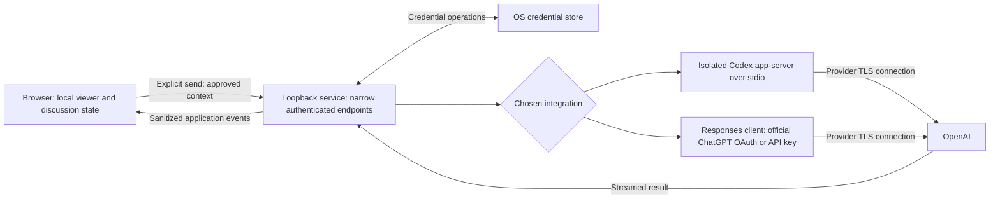

# OpenAI / ChatGPT connection exploration

Research dates: 2026-09-29; updated 2026-09-30 after checking the official Sign in with ChatGPT documentation. Status: documentation review complete; integration choice and runtime validation remain open. This document records findings and a proposed evaluation plan, not approval to implement AI. The local viewer remains the current delivery scope in [PRODUCT.md](../../PRODUCT.md).

## Recommendation

Investigate **official Sign in with ChatGPT calling Responses directly through a minimal local service first**. OpenAI now documents ChatGPT plan usage for open-source and locally hosted apps. This corrects the earlier research finding that no suitable third-party OAuth contract had been established. Paid or remotely hosted apps have a separate interest/onboarding path. Eligibility for this particular account and distribution model still needs validation. [Sign in with ChatGPT overview](https://developers.openai.com/siwc/token-sharing-open-source)

**Product assessment:** direct requests appear better suited to this app's explicit-context, no-action-tools design than embedding a coding-agent runtime. Codex app-server remains a secondary candidate, with the isolation gates below. Neither route has passed a runtime experiment.

Keep **the OpenAI Responses API with a user-provided API key** as the separately billed alternative. Its request contract must be evaluated independently: the subscription preview does not support every standard API parameter. API billing remains a deliberate product choice. [API authentication](https://developers.openai.com/api/reference/overview#authentication), [Subscription preview limitations](https://developers.openai.com/siwc/token-sharing-open-source/preview-limitations)

If subscription access is essential and neither subscription route passes the gates below, retain the standalone viewer. Do not bypass a failed gate by extracting tokens, imitating another OAuth client, or relaxing privacy requirements.

## Scope and evidence

This exploration reviewed public official OpenAI documentation, project requirements, and application source. It did not inspect private exports, browser storage, saved discussions, credentials, or existing Codex sessions. No authentication flow, paid request, model inference, dependency installation, or integration prototype was run.

“Documented” below means a capability is described by an official source. “Proposed” means an application design recommendation. “Unverified” means the target account, runtime, operating system, or product behavior still needs validation. Documentation establishes technical interfaces; it does not prove account eligibility or compatibility with every intended use and distribution model.

The project knowledge page was empty at the time of review; project grounding comes from [AGENTS.md](../../AGENTS.md), [PRODUCT.md](../../PRODUCT.md), and source inspection.

### Requirements that decide the connection

- Preserve the standalone Vue viewer and nyx-kit controls. A local service is permitted only where needed for the supported connection; no hosted proxy or server database.
- Prefer an eligible ChatGPT subscription, with persistent login and automatic refresh where supported. API billing requires a deliberate product decision.
- Send only after an explicit user action, with disclosure that the **complete active conversation JSON**, all its parts and source metadata, the selected focus, discussion history, and question are included.
- Block oversized requests. No silent truncation, summarization, retrieval replacement, or automatic context compaction.
- Give the model no filesystem, shell, browsing, connector, or other action tools.
- Keep long-lived credentials outside browser JavaScript, browser storage, session files, logs, and the repository. Persistent credentials require OS secure storage with no plaintext fallback.
- Keep application discussions independent, locally managed, and explicitly saved/loaded. The archive's IndexedDB exception does not authorize a new AI history database.
- Do not assume integration threads synchronize with the ChatGPT website.

## Options compared

The verdicts are project-fit judgments; supporting documentation follows the table.

| Route | Subscription fit | Runtime | Fit for Echo | Verdict |
| --- | --- | --- | --- | --- |
| Official Sign in with ChatGPT, direct Responses requests | Eligible ChatGPT plan usage documented | Minimal local service | Direct context control; preview limitations and account eligibility need validation | First feasibility candidate |
| Official Codex app-server | Managed ChatGPT sign-in is documented | Local service plus Codex runtime | Agent capabilities and implicit state need investigation | Secondary subscription candidate |
| Codex SDK or noninteractive CLI | Uses Codex's authentication boundary | Server-side runtime/process | Possible alternative wrapper, but does not remove agent behavior | Secondary candidate |
| Responses API with a user-provided key | Separate API billing | Minimal local service | Direct payload, tool, and state control | Preferred technical fallback if billing is accepted |
| Borrowed OAuth clients or arbitrary API access beyond the documented grant | Not established by the supported sign-in flow | Outside the documented contract | Official subscription access does not authorize unrestricted endpoints | Reject as a design assumption |
| ChatGPT plugin / MCP integration | Runs in an eligible ChatGPT host | MCP service and host connection | Moves the experience into ChatGPT and changes the privacy architecture | Alternative product direction |
| ChatKit | Does not establish subscription access | Backend/session integration | Adds UI and server machinery without resolving the account requirement | Poor fit |
| Realtime browser connection | API-backed | Session bootstrap service | Useful for live interaction; unnecessary for this text workflow | Defer |
| Managed workload identity | Administrative API/Codex principal | Managed identity infrastructure | Relevant to enterprise automation, excessive for a personal local viewer | Defer |
| Manual copy into ChatGPT | Uses the user's chosen ChatGPT session | No integration service | Loses in-app streaming, thread binding, and automatic context verification | Optional future handoff, not the AI MVP |
| Shared hosted key, token scraping, private endpoint proxy | No acceptable subscription basis | Hosted or local proxy | Conflicts with architecture or credential rules | Reject |

### 1. Codex app-server

**Documented:** app-server uses bidirectional JSON-RPC, supports stdio, and exposes managed ChatGPT login, logout, model discovery, rate-limit information, thread/turn operations, and streamed events. Managed login owns token persistence and refresh. Its external-token mode is experimental and assumes the host already owns the authentication lifecycle. The protocol also exposes command/process capabilities; the browser must never receive unrestricted access. [App-server protocol and authentication](https://learn.chatgpt.com/docs/app-server)

**Proposed integration:** a small local service owns one isolated Codex process and translates a narrow Echo protocol into allowed operations. Use managed sign-in; do not acquire tokens from the user's development installation. A dedicated runtime configuration and state location must be outside the repository and isolated from existing Codex settings, skills, plugins, memories, and sessions. Isolation must be verified, including credential-store namespace behavior.

**Critical unresolved questions:**

1. Can the pinned runtime remove every action tool from the model's available capabilities, rather than merely deny some executions?
2. Can it send the full approved payload without undisclosed file instructions, memories, extra source context, truncation, or compaction?
3. Can it avoid all automatic transcript, prompt, memory, and debug persistence while retaining credentials securely?
4. Can the target account use this embedded conversational workflow with the intended models and limits? Confirm applicable documented usage conditions for the intended personal or distributed deployment.
5. Can disconnection affect only Echo and clearly distinguish local logout from provider-side revocation?

The configuration reference documents `features.shell_tool`, `web_search`, `model_auto_compact_token_limit`, `history.persistence`, analytics, feedback, and OpenTelemetry controls. These are investigation inputs, not a proven complete lockdown recipe. In particular, `history.persistence = "none"` describes one history mechanism; it does not establish that every runtime artifact is disabled. A compaction threshold is not evidence of a supported “never compact” guarantee. [Configuration reference](https://learn.chatgpt.com/docs/config-file/config-reference)

Read-only sandboxing still permits reads, and command sandbox permissions do not automatically govern hosted search, connectors, MCP, or browser capabilities. An instruction telling the model not to use tools is insufficient. [Permission boundaries](https://learn.chatgpt.com/docs/permissions)

**Candidate experiment:** construct each application turn from local discussion state in a fresh, non-persisting runtime thread, if the pinned schema supports the necessary mode. This may avoid accumulated runtime history, but is only a hypothesis. Verify the actual request and disk effects with synthetic markers before adopting it. Fail the route if these controls cannot satisfy the product contract.

### 2. Codex SDK / CLI

OpenAI positions its SDK for programmatic Codex workflows and app-server for custom clients needing authentication and event handling. The TypeScript SDK is server-side and requires Node.js 18 or later. It supports starting and resuming local threads. [Codex SDK](https://learn.chatgpt.com/docs/codex-sdk)

The project already uses Node tooling, so this is operationally plausible. However, a wrapper does not by itself solve tool removal, automatic context management, secure storage, or retention. Prefer app-server for the interactive connection unless a pinned SDK exposes all required controls more reliably. Do not spawn a CLI process with private input in command-line arguments or enable inherited developer plugins.

### 3. Responses API with a user-provided key

OpenAI recommends Responses for new text-generation integrations. Standard API authentication uses a secret bearer credential kept on the server; a browser key field, frontend environment variable, or browser storage is unsuitable for this project's credential boundary. [Text generation](https://developers.openai.com/api/docs/guides/text), [API authentication](https://developers.openai.com/api/reference/overview#authentication)

**Proposed request policy:** use a fixed OpenAI endpoint, an explicitly selected supported model, foreground streaming, `store: false`, `truncation: "disabled"`, `tools: []`, `tool_choice: "none"`, and a bounded `max_output_tokens`. That output bound includes reasoning tokens. Do not request background mode, compaction, media processing, retrieval, or remote tools. These fields are documented; the combination still needs a synthetic check against the selected model. [Responses create reference](https://developers.openai.com/api/reference/resources/responses/methods/create)

Manage discussion history locally and resend the applicable history explicitly. The API supports manually supplied conversation state; remote Conversations objects and stored response chains are unnecessary for this proposal. Keep one complete source bundle per request rather than repeating it inside every historical user turn. [Conversation state](https://developers.openai.com/api/docs/guides/conversation-state)

**Credential onboarding proposal:** provision the key through a native/local-service setup path that writes directly to the OS credential store. The Vue UI receives connection status only. An environment variable may be useful for an explicit development experiment but is not the proposed durable user experience. Use a dedicated Platform project and appropriately restricted key; never require an organization admin key.

API keys do not provide subscription-style refresh. Replacement is required after revocation or invalidation. The app should remove its local secret on disconnect and explain how to revoke the key through the provider, without requesting broad administrative privileges.

### 4. Official Sign in with ChatGPT and direct Responses access

**Documented, checked 2026-09-30:** the local/open-source flow dynamically registers a client and uses browser authorization with PKCE and a loopback callback. Persist an opaque host identifier and the issued client ID. Identity alone does not authorize inference; the application must verify the granted ChatGPT plan permission. This does not expose existing ChatGPT conversations. [Overview](https://developers.openai.com/siwc/token-sharing-open-source), [Registration and sign-in](https://developers.openai.com/siwc/token-sharing-open-source/sign-in)

Use the authorized OAuth access token with the public Responses endpoint and discover models available to that account. The documented HTTP contract requires `store: false` and `stream: true`; a started stream can still end in a quota error, so wait for a terminal completion event. No Codex runtime is required for this direct route. [Models and inference](https://developers.openai.com/siwc/token-sharing-open-source/models-and-inference)

**Preview constraints relevant to this product:** send context and history explicitly in the input array; HTTP continuation through `previous_response_id` is unavailable. Omit unsupported fields, including `truncation`, `max_output_tokens`, `background`, and `conversation`. Therefore, do not copy the API-key request policy in section 3 unchanged. The exact full-context rejection behavior and output-limit behavior need synthetic validation; these docs do not establish that the app's no-silent-reduction requirement is satisfied. [Preview limitations](https://developers.openai.com/siwc/token-sharing-open-source/preview-limitations)

The application owns token refresh and must serialize refreshes and retain replacement tokens. Provider revocation and local credential removal are separate operations. Our stricter OS secure-store requirement still applies; generic protected runtime storage is insufficient evidence of compliance. [Accounts and sessions](https://developers.openai.com/siwc/token-sharing-open-source/profiles-and-sessions)

**Proposed validation:** prove account eligibility, complete-context handling, absence of action tools, secure credential persistence, renewal and revocation, and applicable provider data handling. Subscription authentication must not inherit assumptions about API-key billing or retention. Use synthetic inputs only.

OpenCode-like UX remains a reference experience, not authorization evidence. Do not borrow client identifiers, copy another application's credential cache, use session cookies, or target private ChatGPT endpoints.

### 5. ChatGPT plugins / MCP

Plugin OAuth authenticates the user **to the plugin's service**: ChatGPT acts as the client and sends that service's token to its MCP server. It does not issue Echo a general OpenAI inference credential. [Plugin authentication](https://developers.openai.com/plugins/build/auth)

An MCP integration could expose an explicitly approved conversation to ChatGPT, but this changes who hosts the discussion and controls context. It also adds a data-access tool, conflicting with the current no-tools analysis contract. A redesigned consent boundary would have to ensure that the host cannot browse arbitrary archive records or fetch additional context automatically.

Remote access does not invariably require a public inbound endpoint: OpenAI documents Secure MCP Tunnel, which forwards requests over an outbound connection and requires suitable organization/workspace associations and permissions. It still makes the service callable by an external host and adds infrastructure and credentials. [Secure MCP Tunnel](https://developers.openai.com/api/docs/guides/secure-mcp-tunnels)

This is worth reconsidering only if the product intentionally becomes a ChatGPT-hosted experience. Do not expose the archive directory through an MCP server or tunnel as an exploratory shortcut.

### 6. Other supported surfaces

- **ChatKit:** provides chat UI and server integration; it is not an account-entitlement mechanism. Current documentation directs new integrations toward a custom server and warns that Agent Builder is being retired. Introducing another chat UI system also conflicts with the intended nyx-kit composition. [ChatKit](https://developers.openai.com/api/docs/guides/chatkit)
- **Realtime:** browser WebRTC can use server-mediated setup or ephemeral API credentials. A backend still protects the standard API key. This is an API session mechanism, not reusable subscription OAuth, and offers little benefit for full-JSON text analysis. [Realtime WebRTC](https://developers.openai.com/api/docs/guides/voice-webrtc?voice-api=realtime)
- **Workload identity:** short-lived credentials map an existing trusted workload to a configured API service account or managed Codex principal. It requires administrative setup; it does not turn personal ChatGPT login into general API access. [Workload identity federation](https://developers.openai.com/api/docs/guides/workload-identity-federation)
- **Manual handoff:** a future copy/export action could prepare a disclosed payload for the user to paste into ChatGPT. This is a product proposal, not a researched automatic handoff API. Clipboard exposure, saved copies, context limits, and manual result return make it an incomplete substitute. Never place conversation text in a URL or automatically paste it into another application.

## Authentication lifecycle and operating systems

Codex documents automatic token refresh and OS credential storage. Explicit `cli_auth_credentials_store = "keyring"` fails when the store is unavailable; `auto` may fall back to plaintext. Shared default credentials also mean logout in one standard client can affect another. Echo therefore needs an isolated credential scope and the explicit keyring mode. [Credential storage](https://learn.chatgpt.com/docs/auth#credential-storage)

Proposed lifecycle requirements, applying to either candidate where relevant:

| State / event | Required behavior |
| --- | --- |
| Disconnected | Viewer works; no conversation transmission |
| Connect | Start only the selected supported auth flow; disclose subscription versus API billing |
| Connecting | Bind completion to the initiating session; support cancellation and callback failure |
| Connected | Show sanitized provider/account status; never expose tokens or credential-store contents |
| Browser reload / service restart | Reuse the application-scoped stored credential; restore no private AI history implicitly |
| Refreshable expiry | Serialize refresh attempts in the credential-owning runtime |
| Revoked / nonrefreshable expiry | Preserve the question and show reconnect; no credential fallback or resend loop |
| Disconnect | Cancel pending login and active work; clear this application's secret/session; verify removal |
| Secure store locked / unavailable | Explain the failure; never downgrade to plaintext |

For Linux, macOS, and Windows, test secure-store availability, locked-store behavior, restart persistence, isolation from other clients, and removal. These are proposed support targets, not verified OS support claims. Headless Linux and WSL require separate validation; browser availability does not establish secure-store availability. If only one OS passes initially, scope the connection release to that OS.

Provider grant revocation and clearing a local credential are different operations. Do not claim that a successful local disconnect revokes every provider session or deletes already sent data. Determine the supported provider-side revocation flow before writing final user-facing copy.

## Proposed local architecture

The following is an application design, conditional on choosing and validating a route:



Only the selected adapter should run. The diagram illustrates alternatives, not an automatic fallback. Direct ChatGPT OAuth and API-key requests need distinct request policies even when they share transport code. Changing connection type or account must never silently change billing or resend a turn.

Prefer serving the built frontend and narrow API from one loopback origin. An optional Node service fits existing tooling; a desktop wrapper is another packaging option but not a security guarantee. The service must not mount the export or inspect the archive cache. The browser supplies the immutable, approved request payload on send.

Local request controls required by this design:

- Bind explicitly to loopback and validate Host and Origin against exact configured values; reject unexpected origins and unauthenticated callers. CORS alone is insufficient.
- Establish browser-to-service authority through a deliberate local pairing/launch mechanism, such as a one-time code entered locally. Do not publish reusable credentials at an unauthenticated bootstrap endpoint.
- Use an expiring application session distinct from provider credentials. Prefer a protected cookie with appropriate HttpOnly/SameSite settings and a CSRF defense; validate browser behavior on the chosen loopback origin. Avoid bearer secrets in URLs, persistent browser storage, or diagnostics.
- Expose only connection status, login/cancel/logout, validated turn start, stream, and cancel operations. Do not forward arbitrary JSON-RPC, paths, provider URLs, shell commands, or client-supplied security overrides.
- Enforce payload size, concurrency, timeouts, model allowlists, and per-session ownership of request IDs. Return `Cache-Control: no-store` for sensitive responses. Do not retain request bodies after their purpose ends.
- Spawn the runtime with argument arrays and input over its protocol, never shell interpolation. Use an allowlisted environment and isolated configuration; prevent inherited proxies, plugins, hooks, or telemetry from changing the intended data flow.
- Reject unexpected tool requests, capability changes, and compaction events. A rejection is a fault signal, not proof that no earlier data access occurred; prevention must be established by the feasibility tests.

DNS rebinding, forged cross-origin requests, another local process, malicious source text, and unsafe rendered output are relevant boundaries. Device compromise, hostile browser extensions, and provider processing cannot be eliminated by a loopback service.

## Full context and current implementation gaps

Source inspection shows that [archive.ts](../../src/lib/archive.ts) builds a normalized `Conversation`/`Message` representation and retains selected files through `AssetIndex`; it does not expose an explicit ordered raw-JSON-parts bundle on each conversation. [archive-storage.ts](../../src/lib/archive-storage.ts) caches file bytes for the viewer. These are code findings, not observations about any actual archive.

Future implementation needs a verified mapping from an active conversation to all its source JSON parts. Do not serialize the rendered message list and call it “full JSON”: rendering normalization, hidden extended messages, and progressive history loading are not the source contract. Preserve unknown fields and source metadata, and define stable anchors for selected text. Keep this mapping inside application memory/local private state.

Proposed send pipeline:

1. Freeze the active conversation version, complete source bundle, focus anchors, discussion history, and question for this turn.
2. Present a preview/disclosure of the exact sharing scope. JSON media references are sent as data; attachment bytes and linked resources are excluded.
3. Validate source completeness and anchors. If the selected source changed, require the user to resolve it before sending.
4. Estimate the serialized request locally, including roles, instructions, history, provider overhead, and response/reasoning allowance. Block known oversize input before any transmission.
5. On explicit send, hand only that immutable payload to the local service. The model receives export content as untrusted quoted data, never promoted into developer instructions.
6. Stream a response into the correct application discussion; validate message references before making them navigable.

The API's token-counting endpoint accepts the request content and counts formatting overhead that local tokenizers may miss. **Calling it also transmits the conversation.** It must not run automatically when a conversation opens or a selection changes. If used after Send, disclose that validation itself sends the payload even when generation is subsequently blocked. Prefer a conservative local preflight; use provider counting only within the explicit consent boundary. [Counting tokens](https://developers.openai.com/api/docs/guides/token-counting)

Check both the model's maximum input and its combined context window:

```text
input_tokens <= model_max_input
input_tokens + reserved_output_and_reasoning + safety_margin <= context_window
```

No character-count shortcut is an exact guarantee. Unsupported model metadata or uncertain runtime overhead must cause a conservative limit or a blocked send. Do not treat successful model generation as proof that all intended input was preserved.

## Models, quotas, and cost

Choose from models available to the actual connection, then test passage interpretation, multilingual text, uncertainty, accurate message references, and refusal to follow instructions embedded in synthetic exports. Do not select solely by model family name or advertised context size.

As a dated API sizing example, GPT-6 Sol and Luna each document a 1,050,000-token context window, a 922,000-token input maximum, and a 128,000-token output maximum. These API specifications are not a promise that a Codex account exposes the same limits. [GPT-6 Sol](https://developers.openai.com/api/docs/models/gpt-6-sol), [GPT-6 Luna](https://developers.openai.com/api/docs/models/gpt-6-luna)

Current Standard API rates, USD per million tokens, for short-context requests:

| Model | Input | Cached input | Cache writes | Output |
| --- | ---: | ---: | ---: | ---: |
| GPT-6 Sol | $2.00 | $0.20 | $2.50 | $10.00 |
| GPT-6 Luna | $0.10 | $0.01 | $0.125 | $0.50 |

Long-context and service-tier rates differ. Recheck prices when implementing; these are planning examples, not a fixed app tariff. [API pricing](https://developers.openai.com/api/docs/pricing)

An entirely synthetic 100,000-token input plus 2,000 billable output tokens is $0.22 for Sol at ordinary uncached input rates, or $0.27 if all input is charged as cache writes; Luna equivalents are $0.011 and $0.0135. These arithmetic examples exclude regional premiums and other adjustments. Actual usage categories determine the bill. Repeated full-context sends can dominate cost even when the selected passage is short.

Proposed cost controls: show an estimate before sending, reserve an output budget, avoid automatic retries after ambiguous delivery, and enforce an app-side spending ceiling if API mode is chosen. Prompt caching is an optimization to evaluate, not a substitute for sending the required complete source or a guaranteed discount.

ChatGPT Work and Codex share plan usage; subscription availability and capacity depend on the account and plan. Do not describe access as unlimited or translate subscription usage directly into API dollars. Surface reported quota/reset information and keep the viewer usable when limits are reached. [ChatGPT/Codex pricing and limits](https://learn.chatgpt.com/docs/pricing)

## Privacy, retention, and local persistence

For the API, submitted content is not used for training by default unless sharing is explicitly enabled. Abuse-monitoring retention is generally up to 30 days, with documented exceptions. Responses have default application-state retention unless storage is disabled; `store: false` is not a promise of zero retention. Approval is required for special retention controls. Prompt caching can retain encrypted tensors for up to 24 hours under documented conditions. [API data controls](https://developers.openai.com/api/docs/guides/your-data)

Do not apply that API policy wholesale to a ChatGPT-authenticated runtime. Authentication mode determines the applicable account/workspace controls. Before a subscription release, verify the intended plan's training settings, retention, and deletion behavior; consumer-plan handling was not conclusively established by the reviewed sources. Local conversation artifacts also need separate review from hosted retention. [Authentication and data-policy boundaries](https://learn.chatgpt.com/docs/auth), [Local data-handling distinctions](https://learn.chatgpt.com/docs/enterprise/chatgpt-work-local-security)

Proposed application behavior:

- Explain before the first send that full conversation JSON is shared even for a short selection. Keep the scope visible on subsequent turns; changed sharing scope requires renewed disclosure.
- Retain discussions in memory and save/load only through the explicit versioned local session-file workflow described in PRODUCT.md. Save no credentials in those files.
- Separate Forget archive, clear discussions, disconnect, and provider-side deletion. Each control must describe exactly what it removes; local deletion cannot retract an already processed request.
- Disable analytics, remote diagnostics, raw payload logs, prompt traces, and automatic crash attachments in the integration. Review SDK/runtime defaults as well as application code.
- Treat model output as untrusted. Render safely, reject executable URL schemes, and do not automatically fetch images or links emitted by the model.
- Test only synthetic content. Runtime probes must use an isolated browser profile and disposable state; never inspect a real cached archive or a developer's authentication files.

## Streaming, cancellation, and failures

Responses supports server-sent streaming events. The application must process terminal completion/failure/incomplete states as well as text deltas; a closed connection is not evidence of successful completion. [Streaming responses](https://developers.openai.com/api/docs/guides/streaming-responses)

Proposed adapter semantics:

| Condition | Behavior |
| --- | --- |
| Authentication failure | Preserve draft; request reconnect without resending automatically |
| Quota exhausted / rate limited | Distinguish exhausted credits from temporary throttling when the provider reports it; show retry timing when known |
| Context too large | Block; explain full-context requirement; never silently reduce the source |
| Network lost after submission | Mark outcome uncertain; warn that retry can repeat processing or charges |
| Cancel | Stop displaying further output and request upstream interruption/abort; retain a clearly marked partial response if useful |
| Output limit reached | Mark response incomplete; do not label partial output as a finished answer |
| Duplicate click / reconnect | Use an application request ID and active-request ownership to prevent duplicate dispatch |
| Different archive/account while sending | Keep the original immutable binding; cancel or finish explicitly, never retarget the request |

Cancellation is best effort and does not guarantee refunded usage or erased provider processing. A deduplication ID in the local service does not establish provider-side exactly-once delivery. Do not blindly inherit an SDK's retry defaults for ambiguous failures.

## Feasibility gates and evaluation plan

These checks are proposed future work; none has been passed by a live prototype during this exploration.

| Gate | Required evidence | Current conclusion |
| --- | --- | --- |
| Supported access | Official integration plus target-account eligibility and intended-use compatibility | Direct ChatGPT OAuth, Codex embedding, and API-key access documented; account/runtime unverified |
| Durable credentials | Secure store across restart; unavailable-store failure; independent disconnect | Documented Codex keyring option; OS behavior unverified |
| No action tools | Effective tool inventory and adversarial tests prove no file/shell/network/connector actions | Unverified for Codex; direct API design can omit tools |
| Exact full context | Complete synthetic multipart input, correct history, no compaction/truncation | Product/source changes and adapter checks required |
| No implicit private persistence | Before/after inspection of disposable runtime state, logs, and traces | Unverified, especially for Codex |
| Informed send | No model/token-count requests before explicit consent; exact payload binding | Future application requirement |
| Local service isolation | Host/origin/session/CSRF checks, no open RPC proxy, no archive mount | Future application requirement |
| Model and quota behavior | Available model, effective limits, predictable errors and cancellation | Account-specific validation required |
| Provider handling | Accurate disclosure for selected auth mode, account, storage, and caching | API baseline documented; subscription details remain open |

Recommended evaluation order:

0. **Evaluate direct Sign in with ChatGPT first.** In disposable state, validate the documented registration flow, account-specific model access, OS credential storage, refresh, and revocation. Then test complete synthetic context, near-limit rejection, tool absence, streaming terminal states, and local persistence. Resolve the unsupported `truncation` and `max_output_tokens` controls before accepting this route. If it passes, skip the Codex-specific steps below; if it fails, record why before evaluating that alternative.

1. **Pin and inspect a Codex release in disposable state.** Generate/read its protocol schema, identify stable versus experimental fields, and enumerate all inherited instruction/configuration sources and capabilities. Do not attach the working repository or any archive.
2. **Exercise authentication only.** With the user's chosen account and isolated keyring scope, test browser login, cancellation, reconnect, restart, secure-store failure, and independent disconnect. No conversation content is needed.
3. **Probe capability and retention boundaries with synthetic inputs.** Confirm zero action tools, no hidden source reads, no automatic memories/transcripts, no telemetry payloads, and no credential leakage. Reject configurations that only rely on model obedience.
4. **Probe full-context behavior.** Use synthetic split histories with markers in early, middle, and late portions; compare the actual serialized input where safely observable, test near-limit rejection, and check every follow-up. Marker recall alone is not proof of complete transmission. Do not intercept real credentials to obtain evidence.
5. **Compare a minimal Responses experiment if API billing is accepted.** Use the same synthetic cases and measure quality, token usage, latency, streaming failures, and cost. No real export is necessary.
6. **Record a route decision.** State supported OSes, runtime/version, model policy, billing, known limits, and all gate results. Only then plan viewer changes and update PRODUCT.md's implementation scope.

No provider message, support request, credential provisioning, or paid experiment is part of this completed documentation task.

## Decisions still needed

- Is a ChatGPT subscription mandatory, or is separately billed API access acceptable if the supported subscription routes cannot meet the constraints?
- Is this a personal local tool only, or must the integration support distribution to other users?
- Which operating systems must have persistent secure login in the first connection release?
- Is explicit local session-file saving still the desired AI persistence model?
- What per-turn and total budget should API mode enforce, if selected?
- Which account/workspace data-handling settings are acceptable for full-conversation transmission?

The proposed next step is the isolated direct Sign in with ChatGPT feasibility evaluation above. Its outcome should decide whether to implement that route, investigate Codex, choose the API-key alternative explicitly, or leave AI deferred.
