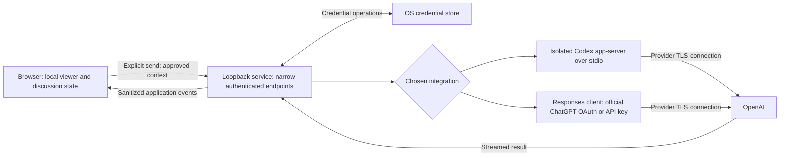

# ChatGPT connection and conversation analysis

## Current Ask Echo context and settings policy

New discussions use the configured default context, initially Last week / Surrounding week. The composer offers Last 24h, Last 48h, Last week, Last month, Last year, All time, and Only selected messages (only while messages are attached). Each Last label becomes Surrounding when a selection exists. Without selection, windows end at the latest valid message timestamp in the active archive, not the current date. With selection, each selected message anchors half the duration before and half after; overlapping windows merge, and gaps between disjoint windows remain excluded. Bounds are inclusive. Durations are elapsed time: 24/48 hours, 7 days, 30 days, and 365 days. Explicitly selected undated messages remain included without expanding a time window; an entirely undated conversation requires All time or a selection.

Context selection stays above the prompt until the first completed response, then remains fixed for that discussion. Selected messages are focus anchors. Follow-ups without new selections reuse the established source context and retained images; new selections add records within the fixed scope. Existing historical scopes and immutable database snapshots remain readable. Old unsent surrounding-message-count drafts use week context in the new UI.

All ChatGPT configuration lives on Echo's Settings page: connection, default model, default context, sharing information, and the development-only inspector preference. The defaults are non-sensitive browser-local preferences and apply to new discussions (context) or subsequent requests (model). Only selected messages is a per-discussion choice requiring attachments, not a global default. A missing configured model requires an explicit replacement; no silent model fallback. The shelf cog navigates to Settings. An unauthenticated Send opens a connection-only modal using the same ChatGPTConnection component as Settings; successful authentication never sends automatically. Inspect context is an optional shelf toolbar action, not a setting or a send gate.

Discussions in the library persist automatically to its local database. Remove file Save/Load controls and browser import/export endpoints; existing database history is retained. The independent browser viewer keeps in-memory discussions but offers no file persistence controls. Hide routine saving/saved status; loading and save errors remain visible above the prompt. Keep everything below the prompt clear. Sharing details live in Settings. Requests remain user-initiated and are never silently truncated to fit limits.

This policy supersedes earlier full/surrounding defaults, scope choices, shelf-settings modals, composer disclosures, and file save/load requirements below. Historical formats remain readable by compatibility code.

## Ask Echo experience

This section records the current product direction. It supersedes the earlier text-only AI proposal where they differ, including its exclusion of selected-media analysis. The connection, privacy, and runtime gates below still apply.

The user-facing feature name is **Ask Echo**, with the `sparkles` icon on its header action and shelf heading. Its cog opens **Ask Echo settings**.

### Two shelves, with room for chat

- Reuse `SideShelf` as two mutually exclusive panels: opening one closes the other, and both may be closed. Information retains its existing 336px desktop width and all its sections. There are no Info / Ask Echo tabs.
- The **Ask Echo** header action toggles a separate shelf. With Ask Echo open, the Instagram timeline and agent chat divide the available width equally, after the conversation sidebar is accounted for.
- Ask Echo has two sections: compact discussion navigation and the chat interface. Discussion navigation provides the current discussion picker, New discussion, rename/delete actions, and a cog for **Ask Echo settings**.
- The settings modal holds ChatGPT connection/check/disconnect controls, model selection, and explicit local discussion save/load. None of these settings occupy the transcript or composer.
- Below 1000px, Ask Echo opens as a full-width, keyboard-accessible overlay. Close it to select messages in the timeline; selecting a message reopens Ask Echo automatically, and a selected-message chip can also return to its original message. Information keeps its existing overlay behavior below 1200px.
- Closing either shelf preserves discussion history, draft, selection, and timeline position. Each Instagram conversation owns its own discussions and selections. Information visibility remains a persisted preference; Ask Echo visibility is session-only.
- Compose from nyx-kit primitives, including its modal, dropdown, select, buttons, icons, and textarea. Preserve default colors and SCSS/BEM conventions.

### Message selection

- Support one selected message, arbitrary multiple messages, and contiguous ranges. Selection uses stable source references, not rendered row indexes or sender names.
- Clicking a message directly toggles its highlight and establishes the range anchor. Selecting through click, Shift-click, or keyboard activation automatically opens Ask Echo, closing Information. Deselecting does not change shelf visibility. On desktop, automatic opening preserves message focus for further keyboard selection; compact overlays retain their focus management. **Shift-click** adds the contiguous range from that anchor to the target. Focused messages support Enter/Space to toggle and Shift+Enter/Space for a range; touch users can tap individual messages. Remove the selection mode, per-message selection buttons, selection toolbar, and “Focus on a passage” section.
- Define ranges against the chronological, currently visible message set, including earlier messages that have not yet been rendered. Extended messages hidden by the viewer preference are not silently selected. Explicit selections persist if subsequently hidden, and remain listed in the selection preview with a route to reveal them.
- Links, text copying, media playback, and lightbox controls keep their existing behavior. Clicking these controls must not accidentally select a message or send anything.
- Show selected messages as attachment-like chips inside the question composer, in chronological order. Each chip has a sender, a truncated text or attachment label, a tiny accessible x button, and a jump back to the message. Keep large selections in a bounded horizontal strip. Chips remain removable when their original rows are outside the rendered timeline; jumping reveals hidden extended messages. All such content is runtime-only private UI.
- This feature starts with whole-message selection. Text-excerpt selection remains a later extension; browser text highlighting does not implicitly create an AI selection.

### Context and focus

The user approved three explicit context scopes, superseding the earlier full-conversation-only requirement:

- **Selected messages only:** complete source records for the selected messages, suited to translation and focused questions. Disable this option when no messages are selected; removing the last selection while this scope is active shows surrounding context instead.
- **Surrounding messages (default):** up to 20 chronological messages before and after each selected message. Merge overlapping windows, clip at conversation boundaries, and retain gaps between distant selections. Use the full loaded source timeline, including messages outside the rendered window. For an initial prompt without selection, include only the latest 20 chronological messages, or all available messages if fewer. Disclose this beside the composer and label the sent turn with its actual message count.
- **Full conversation:** every source JSON part and source field in the active conversation, including for initial prompts without selection.

Show a compact context menu beside the composer and repeat the choice on each sent question. Partial scopes exclude unrelated records and conversation-level metadata. Only the active conversation can supply context. Group conversations stay separate; do not infer a person-level history by joining threads or matching display names.

Each turn contains:

1. The union of the current scope and completed historical turns’ original contexts, preserving unknown fields inside included records and original reference indexes. Full scope also retains all source metadata.
2. Explicit, validated references to any selected messages, labeled as the analysis focus; leave this list empty when no messages are selected.
3. The selected attachments or their disclosed derived representations, subject to the modality rules below.
4. The current discussion's previous questions, answers, and per-turn focus references.
5. The new question and fixed instructions to treat export content as untrusted evidence, focus on the selection, and use the rest to understand context.

The agent should distinguish observations from interpretations, acknowledge ambiguity, and avoid claiming certainty about a participant's motives. It can cite known messages and explain how surrounding history affects its reading. It has no action tools and cannot browse other conversations or fetch linked content.

Freeze the conversation version, scope, context references, source parts, selection, media manifest, history, model, and question together for each send. Changing selection afterward affects the next turn only. Historical turns retain their original focus, scope, source references, and disclosed media context. Once a send is accepted, clear its attached-message selection and range anchor where applicable, without clearing different messages selected while dispatch was pending. A rejected send preserves selection; retries restore the failed turn’s focus.

After at least one completed response, a nonempty prompt may be sent with no new selection. Its internal `discussion` scope adds no new references or images, irrespective of the last selected scope; it reuses the completed questions, answers, exact source union, and image copies from that discussion. Display “Existing discussion” in the composer and turn. A nonempty initial prompt may have no selection: use the surrounding or full scope chosen in the composer. Initial prompts without selection include source text/metadata but no image bytes. Require an available conversation with messages and reject empty questions. A discussion-only follow-up still requires completed initial context, including an initial turn without selection; failed or canceled turns do not establish that context.

Narrowing a follow-up never erases previously shared context: explain that earlier context remains included, with an explicit notice when it includes the full conversation. Start a new discussion to leave that history behind. A source change invalidates the prepared turn and requires preparing the context again.

Never change the chosen scope to fit a limit. Block requests exceeding local transfer/image safeguards; distinguish these from provider context-capacity rejection after sending. Preserve the draft and offer narrower context or a new discussion through a new explicit Send action. No automatic summarization, retrieval, or truncation.

### Optional developer inspector

Developer mode is default-off and available only under Ask Echo settings in development builds. Store only the boolean preference in localStorage. Enabling it adds an inline **Inspect context** action: show the complete provider request text, image previews (rather than base64 in the text view), source counts, scope, historical turns, and excluded assets. Inspection is local and sends nothing. It never opens a context modal or blocks Send. While enabled, the inspector can also display the last submitted request. Label prepared versus submitted snapshots, invalidate unsent snapshots when inputs change, and clear snapshots on discussion/conversation changes or when developer mode is disabled. Keep all payloads in memory, with no logging or automatic exports. Production builds exclude the inspector module and ignore the preference; this is a build boundary, not a personal authentication mechanism.

### Selected images, video, and audio

The first release analyzes text and selected images. Audio and video analysis are deferred by the user's explicit decision; their existing local playback remains available. JSON paths alone never establish that the model saw or heard an attachment. Include actual supported image input; never invent an interpretation when the asset is missing or unreadable.

Only attachments belonging to the selected messages are candidates for media analysis. Other attachments remain source-JSON references unless separately selected. Show each selected attachment's inclusion status, processing method, and any omissions before sending. Do not silently fetch remote links or GIFs for analysis; previously viewed remote media does not automatically authorize sharing it with OpenAI.

| Selected media | Desired analysis | Connection constraint / implementation requirement |
| --- | --- | --- |
| Image | Interpret the actual image alongside its message and surrounding conversation | Subscription flow documents image input for compatible models. Validate formats, dimensions, byte limits, and model capability; disclose resizing or conversion. |
| Video | Understand relevant visual events and spoken content | Subscription flow excludes native video input. A possible route is local timestamped frame extraction plus local audio transcription. Sampling cannot be described as watching the entire video; disclose intervals, coverage, and missing sound. |
| Audio / voice note | Understand the spoken content in context | Subscription flow excludes audio input and its transcription endpoint. Local transcription or a separately authorized API route needs its own feasibility decision. A transcript does not establish vocal tone or non-speech sounds. |

These subscription limits were verified in the [official preview limitations](https://developers.openai.com/siwc/token-sharing-open-source/preview-limitations). They apply to direct requests and the documented app-server route; changing wrappers does not unlock the excluded modalities.

**Decision: stage the release at text and images.** Do not implement local transcription, video-frame extraction, separately billed API fallback, or cloud transcription in this release. The video/audio options in the table are future feasibility candidates. Revisit processing and billing explicitly before expanding support.

If a selected asset cannot be analyzed, explain why and block analysis of that asset. Continue with its text and metadata under the visible composer disclosure that audio/video are excluded. List exact exclusions on the sent turn and in the optional developer inspector, and retain them in model instructions. Never report successful media analysis based only on filenames, metadata, or a poster image.

### Review, send, and follow-up chat

- Render assistant responses with the published nyx-kit 2.2.0 `NyxMarkdown` component, passing the full accumulated response as `content`. Preserve the kit’s Markdown typography and default colors, with small prose sizing and a heading offset of two. Echo supplies a typed inline rule for validated source references and renders citation jump buttons through the `inline` slot. Unknown references remain text; code, escaped markers, and link labels do not become citation buttons. Keep HTML inert, unsafe links noninteractive, and Markdown images as text without resource requests. Streaming, follow-output scrolling, and navigation remain Echo-owned.
- Use a clean transcript with right-aligned user bubbles and readable assistant responses. The empty state gives short selection guidance. Keep the composer pinned below the independently scrolling transcript; follow streamed responses only while the reader is near the bottom.
- The composer is a single rounded surface containing selected-message chips and a growing textarea. Position an icon-only arrow-up send button inside the textarea area and reserve text padding so it never overlaps writing. **Enter** starts sending; **Shift+Enter** inserts a newline, and composition/IME Enter does not send. While streaming, the same position provides Stop.
- Enter or the send button prepares and sends the immutable payload directly. There is no sharing confirmation modal, checkbox, or repeated approval, including for a first prompt or expanded context. If no question was written but messages are attached, use the visible default analysis question. Context preparation errors keep the draft and prevent dispatch.
- Before sending, show scope, historical context, selected-message chips, and static-image/audio/video disclosure in the composer. Provide exact request inspection only through the opt-in developer inspector. Source references and raw content must never enter diagnostics.
- Keep sharing scope visible on follow-ups. A changed selection, added attachment, changed processing method, account, or model invalidates any prepared payload; the next user-initiated send prepares a fresh one. Connecting, opening the shelf, selection changes, media preparation, and typing must not transmit conversation content.
- The user explicitly sends each turn. Follow-ups may keep the same focus or select a new focus within the same conversation. No automatic analysis or background resends.
- Stream answers into that discussion; support Stop and explicit Retry. Mark incomplete, canceled, and uncertain-delivery turns accurately. Preserve drafts after failures, prevent duplicate dispatch, and never treat stream closure alone as completion.
- Maintain independent discussions per conversation with New discussion, rename, reopen, and delete. Closing the shelf does not delete a discussion. Follow the explicit local session-file save/load model from PRODUCT.md; archive caching does not authorize automatically persisting AI history in IndexedDB.
- Render answers as untrusted content. Only validated message anchors become timeline links; model-generated links and media do not trigger automatic network requests.

### Implementation sequence and acceptance

1. **Connection feasibility:** validate the official direct subscription route using isolated synthetic state, OS credential storage, account-specific models, scope checks, refresh/revocation, full-context behavior, and terminal stream handling. Record evidence and remaining limits before enabling private-content sends.
2. **Context foundation:** preserve all raw JSON parts with stable message anchors and source-version validation. Test completeness independently from normalization, pagination, filtering, and display transformations.
3. **Shelf and selection:** add separate information and analysis shelves, direct single/multiple/range selection, composer chips, settings and sharing dialogs, and per-conversation draft state. Selection and opening Ask Echo must produce no provider requests.
4. **Text and image turns:** add immutable payload preparation, local context preflight, explicit send, streaming, cancellation, retry, and correctly bound follow-up history after the connection gate passes.
5. **Unsupported media:** show clear audio/video exclusions and missing/unreadable image states. Defer video/audio processing; the composer discloses text-only handling and sent turns show the exclusions.
6. **Discussion lifecycle and verification:** implement explicit local save/load, source mismatch handling, and synthetic end-to-end checks. Keep the standalone viewer operational when the connection is missing or unavailable.

Acceptance includes Shift selection across progressive history; noncontiguous selection; keyboard and touch operation; no accidental selection from media controls; focus and scroll restoration; cross-conversation isolation; complete multipart JSON with unknown fields; exact per-turn focus/history; no transmission before Send; correct image inclusion; explicit video/audio exclusions; near-limit rejection without reduction; failures after partial streaming; and credential/non-payload-log checks. All fixtures and runtime probes must be entirely synthetic.

## Recommendation

### Implemented route and limits

- **User authorization:** Ask Echo → Settings (cog) → Continue with ChatGPT. The normal flow needs no terminal login. The app opens the provider in a new tab, validates state/PKCE/nonce and signed identity, checks plan permission, and binds a new HttpOnly browser session. For a localhost UI, the required 127.0.0.1 callback returns to localhost for the initiating-cookie check before credentials become active. The user reported that this flow works.
- **Local runtime:** [the connection service](../../server/chatgpt.mjs) runs through a Vite plugin in both `pnpm dev` and `pnpm preview`. It accepts only the exact loopback hosts/origins for that port, checks local peer addresses, requires an application request header and authenticated browser cookie for protected actions, and exposes no arbitrary provider proxy. JSON analysis bodies are bounded. Server/helper modules are denied through the development file server and remain outside the frontend bundle.
- **Credential lifecycle:** Linux Secret Service via `secret-tool`, with a dedicated application entry, readback verification, serialized renewal, and an exclusive OS-managed `flock` (util-linux) lease. The non-secret lock file stays in place; lock ownership ends when its holder exits, including after parent-process termination. Vite shutdown/restart awaits service cleanup. Do not delete lock files while a service is running; an old empty lock directory is reusable without manual cleanup. The browser session hash and expiry are stored with the credential so a valid browser session can survive service restart. Reconnect starts explicit consent again; Disconnect removes this app's credential/session and preserves the non-secret host identifier. Provider-side revocation remains a separate ChatGPT settings action. Other OS credential adapters are not implemented.
- **Models:** populate the picker from the connected account's current `visibility: "list"` catalog, preserving provider order and display names. Do not restrict it to hardcoded release IDs. The same catalog supplies the connection check and is checked again before each analysis send; a submitted model absent from it is rejected. Refresh models after a successful check and offer a retry for an empty or failed lookup. Model listings are not proof of request-specific capacity or modality support. [Models and inference](https://developers.openai.com/siwc/token-sharing-open-source/models-and-inference)
- **Context limits:** the earlier 600,000-byte serialized-text ceiling has been removed; it was an application limit, not evidence of a model’s token capacity. Retain a separately labeled 24 MB transfer ceiling and eight image copies across current/completed turns. Source images fit within 1024 × 1024 pixels; local inputs over 15 MiB or decoded images over 40 megapixels are excluded. The subscription model catalog documentation establishes identifiers and display metadata, but not reliable per-model input/context limits or tokenizers. Model-aware token preflight is therefore not implemented: document that model capacity is unverified and handle provider context errors after explicit Send. Do not infer subscription capacity from API model specs. HTTP and streamed context errors are sanitized; drafts remain available and nothing is automatically shortened.
- **Source serialization:** raw archive strings remain local and bind discussions to a full-source SHA-256 version. Build only the union of chosen turn scopes before posting to the local service. Partial parts contain sparse `messages` objects keyed by original zero-based indexes, preserving `pN:mN` citations without null-padding or renumbering. Omit unrelated metadata in partial scopes. Full-context parts retain their arrays and metadata. Remove only insignificant JSON whitespace; preserve unknown fields, strings, escapes, and numeric literals exactly. Embed JSON values directly in the provider context instead of double-encoding them as strings. A separate prepared-context digest is checked by the service; it validates included references and rejects undisclosed partial-scope records/metadata. The complete-source hash binds local history and is not proof of source authenticity to the server.
- **Privacy boundary:** the browser prepares all source context and images locally. Only an explicit user Send posts that immutable payload to the local service and then OpenAI. Connecting and listing models do not send archive content. Check connection is separately labeled as a synthetic request that uses plan capacity. No token-counting, cloud transcription, remote image fetching, or provider Conversations storage is used.
- **Transport:** `store: false`, streaming enabled, complete history in `input`, fixed instructions, and no tools. No unsupported preview fields are added. The service emits only text deltas and sanitized terminal states; cancellation aborts the upstream fetch. Duplicate request IDs are rejected within the running service, and errors never auto-retry. Failed or stopped turns remain visible but are excluded from follow-up model history until the user explicitly retries.
- **Discussions:** independent per conversation, with create/rename/reopen/delete and explicit versioned JSON save/load. Version-4 saved files support initial prompts without selection and attachment-free follow-ups and include questions, answers, draft scope, immutable per-turn scope/references, prepared images, and a source-version hash. Version-1 files migrate as full-context discussions and version-2 files retain their saved scopes, and version-3 files retain their follow-ups. Restore turns in order and require earlier completed context for attachment-free follow-ups; failed or canceled turns cannot establish it. Files contain no provider credentials or raw source bundle. Restoring against a different source version is blocked. They are not automatically cached in IndexedDB or synchronized to ChatGPT history.

Automated evidence covers the OAuth callback boundary, both localhost and 127.0.0.1 browser origins, source completeness, range selection, per-turn focus/history, explicit send, actual prepared image bytes, local save/load, duplicate dispatch, and failed streams. Runtime output and fixtures remain synthetic. The user has confirmed live sign-in and a successful synthetic Check connection request. Private-conversation inference and all OS/provider lifecycle edges are not claimed as verified by those checks. A subsequent failure exposed a mismatch between unrestricted probe models and a two-model analysis allowlist; the picker and send-time validation now use the same live account catalog.

Use **official Sign in with ChatGPT calling Responses directly through the minimal local service** implemented on this branch. OpenAI now documents ChatGPT plan usage for open-source and locally hosted apps. This corrects the earlier research finding that no suitable third-party OAuth contract had been established. Paid or remotely hosted apps have a separate interest/onboarding path. Eligibility for this particular account and distribution model still needs validation. [Sign in with ChatGPT overview](https://developers.openai.com/siwc/token-sharing-open-source)

**Product assessment:** direct requests appear better suited to this app's explicit-context, no-action-tools design than embedding a coding-agent runtime. Codex app-server remains a secondary candidate, with the isolation gates below. The user confirmed the direct route’s UI sign-in after the localhost callback fix. Provider inference and lifecycle checks remain distinct from that sign-in confirmation; Codex is not embedded.

Keep **the OpenAI Responses API with a user-provided API key** as the separately billed alternative. Its request contract must be evaluated independently: the subscription preview does not support every standard API parameter. API billing remains a deliberate product choice. [API authentication](https://developers.openai.com/api/reference/overview#authentication), [Subscription preview limitations](https://developers.openai.com/siwc/token-sharing-open-source/preview-limitations)

If subscription access is essential and neither subscription route passes the gates below, retain the standalone viewer. Do not bypass a failed gate by extracting tokens, imitating another OAuth client, or relaxing privacy requirements.

## Scope and evidence

This work reviewed public official OpenAI documentation, project requirements, and application source, and implemented the UI connection and analysis flow described below. It did not inspect private exports, browser storage, saved discussions, credentials, or existing Codex sessions. The user completed UI sign-in and reported success. The agent did not inspect that account’s credentials or run a live inference request. Automated protocol, service, and browser tests use only synthetic values and mocked providers.

“Documented” below means a capability is described by an official source. “Proposed” means an application design recommendation. “Unverified” means the target account, runtime, operating system, or product behavior still needs validation. Documentation establishes technical interfaces; it does not prove account eligibility or compatibility with every intended use and distribution model.

The project knowledge page was empty during initial review and later returned stale AI-deferred guidance; the current user decisions supersede it. Project grounding comes from [AGENTS.md](../../AGENTS.md), [PRODUCT.md](../../PRODUCT.md), and source inspection.

### Requirements that decide the connection

- Preserve the standalone Vue viewer and nyx-kit controls. A local service is permitted only where needed for the supported connection; no hosted proxy or server database.
- Prefer an eligible ChatGPT subscription, with persistent login and automatic refresh where supported. API billing requires a deliberate product decision.
- Send only after an explicit user action, with disclosure of the **chosen context scope**, the exact source union retained from completed turns, selected focus, discussion history, and question.
- Block oversized requests. No silent truncation, summarization, retrieval replacement, or automatic context compaction.
- Give the model no filesystem, shell, browsing, connector, or other action tools.
- Keep long-lived credentials outside browser JavaScript, browser storage, session files, logs, and the repository. Persistent credentials require OS secure storage with no plaintext fallback.
- Keep application discussions independent, locally managed, and explicitly saved/loaded. The archive's IndexedDB exception does not authorize a new AI history database.
- Do not assume integration threads synchronize with the ChatGPT website.

## Options compared

The verdicts are project-fit judgments; supporting documentation follows the table.

| Route | Subscription fit | Runtime | Fit for Echo | Verdict |
| --- | --- | --- | --- | --- |
| Official Sign in with ChatGPT, direct Responses requests | Eligible ChatGPT plan usage documented | Minimal local service | Direct context control; preview limitations and account eligibility need validation | First feasibility candidate |
| Official Codex app-server | Managed ChatGPT sign-in is documented | Local service plus Codex runtime | Agent capabilities and implicit state need investigation | Secondary subscription candidate |
| Codex SDK or noninteractive CLI | Uses Codex's authentication boundary | Server-side runtime/process | Possible alternative wrapper, but does not remove agent behavior | Secondary candidate |
| Responses API with a user-provided key | Separate API billing | Minimal local service | Direct payload, tool, and state control | Preferred technical fallback if billing is accepted |
| Borrowed OAuth clients or arbitrary API access beyond the documented grant | Not established by the supported sign-in flow | Outside the documented contract | Official subscription access does not authorize unrestricted endpoints | Reject as a design assumption |
| ChatGPT plugin / MCP integration | Runs in an eligible ChatGPT host | MCP service and host connection | Moves the experience into ChatGPT and changes the privacy architecture | Alternative product direction |
| ChatKit | Does not establish subscription access | Backend/session integration | Adds UI and server machinery without resolving the account requirement | Poor fit |
| Realtime browser connection | API-backed | Session bootstrap service | Useful for live interaction; unnecessary for this text workflow | Defer |
| Managed workload identity | Administrative API/Codex principal | Managed identity infrastructure | Relevant to enterprise automation, excessive for a personal local viewer | Defer |
| Manual copy into ChatGPT | Uses the user's chosen ChatGPT session | No integration service | Loses in-app streaming, thread binding, and automatic context verification | Optional future handoff, not the AI MVP |
| Shared hosted key, token scraping, private endpoint proxy | No acceptable subscription basis | Hosted or local proxy | Conflicts with architecture or credential rules | Reject |

### 1. Codex app-server

**Documented:** app-server uses bidirectional JSON-RPC, supports stdio, and exposes managed ChatGPT login, logout, model discovery, rate-limit information, thread/turn operations, and streamed events. Managed login owns token persistence and refresh. Its external-token mode is experimental and assumes the host already owns the authentication lifecycle. The protocol also exposes command/process capabilities; the browser must never receive unrestricted access. [App-server protocol and authentication](https://learn.chatgpt.com/docs/app-server)

**Proposed integration:** a small local service owns one isolated Codex process and translates a narrow Echo protocol into allowed operations. Use managed sign-in; do not acquire tokens from the user's development installation. A dedicated runtime configuration and state location must be outside the repository and isolated from existing Codex settings, skills, plugins, memories, and sessions. Isolation must be verified, including credential-store namespace behavior.

**Critical unresolved questions:**

1. Can the pinned runtime remove every action tool from the model's available capabilities, rather than merely deny some executions?
2. Can it send the full approved payload without undisclosed file instructions, memories, extra source context, truncation, or compaction?
3. Can it avoid all automatic transcript, prompt, memory, and debug persistence while retaining credentials securely?
4. Can the target account use this embedded conversational workflow with the intended models and limits? Confirm applicable documented usage conditions for the intended personal or distributed deployment.
5. Can disconnection affect only Echo and clearly distinguish local logout from provider-side revocation?

The configuration reference documents `features.shell_tool`, `web_search`, `model_auto_compact_token_limit`, `history.persistence`, analytics, feedback, and OpenTelemetry controls. These are investigation inputs, not a proven complete lockdown recipe. In particular, `history.persistence = "none"` describes one history mechanism; it does not establish that every runtime artifact is disabled. A compaction threshold is not evidence of a supported “never compact” guarantee. [Configuration reference](https://learn.chatgpt.com/docs/config-file/config-reference)

Read-only sandboxing still permits reads, and command sandbox permissions do not automatically govern hosted search, connectors, MCP, or browser capabilities. An instruction telling the model not to use tools is insufficient. [Permission boundaries](https://learn.chatgpt.com/docs/permissions)

**Candidate experiment:** construct each application turn from local discussion state in a fresh, non-persisting runtime thread, if the pinned schema supports the necessary mode. This may avoid accumulated runtime history, but is only a hypothesis. Verify the actual request and disk effects with synthetic markers before adopting it. Fail the route if these controls cannot satisfy the product contract.

### 2. Codex SDK / CLI

OpenAI positions its SDK for programmatic Codex workflows and app-server for custom clients needing authentication and event handling. The TypeScript SDK is server-side and requires Node.js 18 or later. It supports starting and resuming local threads. [Codex SDK](https://learn.chatgpt.com/docs/codex-sdk)

The project already uses Node tooling, so this is operationally plausible. However, a wrapper does not by itself solve tool removal, automatic context management, secure storage, or retention. Prefer app-server for the interactive connection unless a pinned SDK exposes all required controls more reliably. Do not spawn a CLI process with private input in command-line arguments or enable inherited developer plugins.

### 3. Responses API with a user-provided key

OpenAI recommends Responses for new text-generation integrations. Standard API authentication uses a secret bearer credential kept on the server; a browser key field, frontend environment variable, or browser storage is unsuitable for this project's credential boundary. [Text generation](https://developers.openai.com/api/docs/guides/text), [API authentication](https://developers.openai.com/api/reference/overview#authentication)

**Proposed request policy:** use a fixed OpenAI endpoint, an explicitly selected supported model, foreground streaming, `store: false`, `truncation: "disabled"`, `tools: []`, `tool_choice: "none"`, and a bounded `max_output_tokens`. That output bound includes reasoning tokens. Do not request background mode, compaction, retrieval, or remote tools. Selected image inputs belong to the explicitly reviewed sharing scope. These fields are documented; the combination still needs a synthetic check against the selected model. [Responses create reference](https://developers.openai.com/api/reference/resources/responses/methods/create)

Manage discussion history locally and resend the applicable history explicitly. The API supports manually supplied conversation state; remote Conversations objects and stored response chains are unnecessary for this proposal. Keep one union of disclosed source context per request rather than repeating it inside every historical user turn. [Conversation state](https://developers.openai.com/api/docs/guides/conversation-state)

**Credential onboarding proposal:** provision the key through a native/local-service setup path that writes directly to the OS credential store. The Vue UI receives connection status only. An environment variable may be useful for an explicit development experiment but is not the proposed durable user experience. Use a dedicated Platform project and appropriately restricted key; never require an organization admin key.

API keys do not provide subscription-style refresh. Replacement is required after revocation or invalidation. The app should remove its local secret on disconnect and explain how to revoke the key through the provider, without requesting broad administrative privileges.

### 4. Official Sign in with ChatGPT and direct Responses access

**Documented, checked 2026-09-30:** the local/open-source flow dynamically registers a client and uses browser authorization with PKCE and a loopback callback. Persist an opaque host identifier and the issued client ID. Identity alone does not authorize inference; the application must verify the granted ChatGPT plan permission. This does not expose existing ChatGPT conversations. [Overview](https://developers.openai.com/siwc/token-sharing-open-source), [Registration and sign-in](https://developers.openai.com/siwc/token-sharing-open-source/sign-in)

Use the authorized OAuth access token with the public Responses endpoint and discover models available to that account. The documented HTTP contract requires `store: false` and `stream: true`; a started stream can still end in a quota error, so wait for a terminal completion event. No Codex runtime is required for this direct route. [Models and inference](https://developers.openai.com/siwc/token-sharing-open-source/models-and-inference)

**Preview constraints relevant to this product:** send context and history explicitly in the input array; HTTP continuation through `previous_response_id` is unavailable. Omit unsupported fields, including `truncation`, `max_output_tokens`, `background`, and `conversation`. Therefore, do not copy the API-key request policy in section 3 unchanged. The exact full-context rejection behavior and output-limit behavior need synthetic validation; these docs do not establish that the app's no-silent-reduction requirement is satisfied. [Preview limitations](https://developers.openai.com/siwc/token-sharing-open-source/preview-limitations)

The application owns token refresh and must serialize refreshes and retain replacement tokens. Provider revocation and local credential removal are separate operations. Our stricter OS secure-store requirement still applies; generic protected runtime storage is insufficient evidence of compliance. [Accounts and sessions](https://developers.openai.com/siwc/token-sharing-open-source/profiles-and-sessions)

**Proposed validation:** prove account eligibility, complete-context handling, absence of action tools, secure credential persistence, renewal and revocation, and applicable provider data handling. Subscription authentication must not inherit assumptions about API-key billing or retention. Use synthetic inputs only.

OpenCode-like UX remains a reference experience, not authorization evidence. Do not borrow client identifiers, copy another application's credential cache, use session cookies, or target private ChatGPT endpoints.

### 5. ChatGPT plugins / MCP

Plugin OAuth authenticates the user **to the plugin's service**: ChatGPT acts as the client and sends that service's token to its MCP server. It does not issue Echo a general OpenAI inference credential. [Plugin authentication](https://developers.openai.com/plugins/build/auth)

An MCP integration could expose an explicitly approved conversation to ChatGPT, but this changes who hosts the discussion and controls context. It also adds a data-access tool, conflicting with the current no-tools analysis contract. A redesigned consent boundary would have to ensure that the host cannot browse arbitrary archive records or fetch additional context automatically.

Remote access does not invariably require a public inbound endpoint: OpenAI documents Secure MCP Tunnel, which forwards requests over an outbound connection and requires suitable organization/workspace associations and permissions. It still makes the service callable by an external host and adds infrastructure and credentials. [Secure MCP Tunnel](https://developers.openai.com/api/docs/guides/secure-mcp-tunnels)

This is worth reconsidering only if the product intentionally becomes a ChatGPT-hosted experience. Do not expose the archive directory through an MCP server or tunnel as an exploratory shortcut.

### 6. Other supported surfaces

- **ChatKit:** provides chat UI and server integration; it is not an account-entitlement mechanism. Current documentation directs new integrations toward a custom server and warns that Agent Builder is being retired. Introducing another chat UI system also conflicts with the intended nyx-kit composition. [ChatKit](https://developers.openai.com/api/docs/guides/chatkit)
- **Realtime:** browser WebRTC can use server-mediated setup or ephemeral API credentials. A backend still protects the standard API key. This is an API session mechanism, not reusable subscription OAuth, and offers little benefit for full-JSON text analysis. [Realtime WebRTC](https://developers.openai.com/api/docs/guides/voice-webrtc?voice-api=realtime)
- **Workload identity:** short-lived credentials map an existing trusted workload to a configured API service account or managed Codex principal. It requires administrative setup; it does not turn personal ChatGPT login into general API access. [Workload identity federation](https://developers.openai.com/api/docs/guides/workload-identity-federation)
- **Manual handoff:** a future copy/export action could prepare a disclosed payload for the user to paste into ChatGPT. This is a product proposal, not a researched automatic handoff API. Clipboard exposure, saved copies, context limits, and manual result return make it an incomplete substitute. Never place conversation text in a URL or automatically paste it into another application.

## Authentication lifecycle and operating systems

Codex documents automatic token refresh and OS credential storage. Explicit `cli_auth_credentials_store = "keyring"` fails when the store is unavailable; `auto` may fall back to plaintext. Shared default credentials also mean logout in one standard client can affect another. Echo therefore needs an isolated credential scope and the explicit keyring mode. [Credential storage](https://learn.chatgpt.com/docs/auth#credential-storage)

Proposed lifecycle requirements, applying to either candidate where relevant:

| State / event | Required behavior |
| --- | --- |
| Disconnected | Viewer works; no conversation transmission |
| Connect | Start only the selected supported auth flow; disclose subscription versus API billing |
| Connecting | Bind completion to the initiating session; support cancellation and callback failure |
| Connected | Show sanitized provider/account status; never expose tokens or credential-store contents |
| Browser reload / service restart | Reuse the application-scoped stored credential; restore no private AI history implicitly |
| Refreshable expiry | Serialize refresh attempts in the credential-owning runtime |
| Revoked / nonrefreshable expiry | Preserve the question and show reconnect; no credential fallback or resend loop |
| Disconnect | Cancel pending login and active work; clear this application's secret/session; verify removal |
| Secure store locked / unavailable | Explain the failure; never downgrade to plaintext |

For Linux, macOS, and Windows, test secure-store availability, locked-store behavior, restart persistence, isolation from other clients, and removal. These are proposed support targets, not verified OS support claims. Headless Linux and WSL require separate validation; browser availability does not establish secure-store availability. If only one OS passes initially, scope the connection release to that OS.

Provider grant revocation and clearing a local credential are different operations. Do not claim that a successful local disconnect revokes every provider session or deletes already sent data. Determine the supported provider-side revocation flow before writing final user-facing copy.

## Proposed local architecture

The following is an application design, conditional on choosing and validating a route:



Only the selected adapter should run. The diagram illustrates alternatives, not an automatic fallback. Direct ChatGPT OAuth and API-key requests need distinct request policies even when they share transport code. Changing connection type or account must never silently change billing or resend a turn.

Prefer serving the built frontend and narrow API from one loopback origin. An optional Node service fits existing tooling; a desktop wrapper is another packaging option but not a security guarantee. The service must not mount the export or inspect the archive cache. The browser supplies the immutable, approved request payload on send.

Local request controls required by this design:

- Bind explicitly to loopback and validate Host and Origin against exact configured values; reject unexpected origins and unauthenticated callers. CORS alone is insufficient.
- Establish browser-to-service authority through a deliberate local pairing/launch mechanism, such as a one-time code entered locally. Do not publish reusable credentials at an unauthenticated bootstrap endpoint.
- Use an expiring application session distinct from provider credentials. Prefer a protected cookie with appropriate HttpOnly/SameSite settings and a CSRF defense; validate browser behavior on the chosen loopback origin. Avoid bearer secrets in URLs, persistent browser storage, or diagnostics.
- Expose only connection status, login/cancel/logout, validated turn start, stream, and cancel operations. Do not forward arbitrary JSON-RPC, paths, provider URLs, shell commands, or client-supplied security overrides.
- Enforce payload size, concurrency, timeouts, model allowlists, and per-session ownership of request IDs. Return `Cache-Control: no-store` for sensitive responses. Do not retain request bodies after their purpose ends.
- Spawn the runtime with argument arrays and input over its protocol, never shell interpolation. Use an allowlisted environment and isolated configuration; prevent inherited proxies, plugins, hooks, or telemetry from changing the intended data flow.
- Reject unexpected tool requests, capability changes, and compaction events. A rejection is a fault signal, not proof that no earlier data access occurred; prevention must be established by the feasibility tests.

DNS rebinding, forged cross-origin requests, another local process, malicious source text, and unsafe rendered output are relevant boundaries. Device compromise, hostile browser extensions, and provider processing cannot be eliminated by a loopback service.

## Full context and current implementation gaps

[archive.ts](../../src/lib/archive.ts) now retains exact ordered source JSON strings on each conversation, plus part/index references on normalized messages. Malformed sibling JSON marks that conversation’s source incomplete and blocks analysis. [archive-storage.ts](../../src/lib/archive-storage.ts) caches file bytes for the viewer. These are code findings, not observations about any actual archive.

The implemented mapping is independent of display normalization, filters, and progressive history loading. Do not serialize the rendered message list and call it “full JSON”: rendering normalization, hidden extended messages, and progressive history loading are not the source contract. Preserve unknown fields and source metadata, and define stable anchors for selected text. Keep this mapping inside application memory/local private state.

Proposed send pipeline:

1. Freeze the active conversation version, scope, source references, prepared source union, focus anchors, discussion history, and question for this turn.
2. Keep context disclosure visible in the composer. JSON media references are sent as data. Include selected image bytes, disclose unsupported modalities and resulting exclusions, and never fetch linked resources automatically. Exact payload inspection is optional developer tooling, not a send gate.
3. Validate source completeness and anchors. If the selected source changed, require the user to resolve it before sending.
4. Validate the disclosed source union, prepared-context digest, image ceilings, and local transfer size. The current subscription route cannot verify model token capacity locally; disclose that limitation.
5. On explicit send, hand only that immutable payload to the local service. The model receives export content as untrusted quoted data, never promoted into developer instructions.
6. Stream a response into the correct application discussion; validate message references before making them navigable.

The API's token-counting endpoint accepts the request content and counts formatting overhead that local tokenizers may miss. **Calling it also transmits the conversation.** It must not run automatically when a conversation opens or a selection changes. If used after Send, disclose that validation itself sends the payload even when generation is subsequently blocked. Prefer a conservative local preflight; use provider counting only within the explicit consent boundary. [Counting tokens](https://developers.openai.com/api/docs/guides/token-counting)

Future model-aware preflight requires verified subscription capacity metadata and a compatible tokenizer; neither is established by the current catalog documentation. Once supported, check both maximum input and the combined context window:

```text
input_tokens <= model_max_input
input_tokens + reserved_output_and_reasoning + safety_margin <= context_window
```

No character-count shortcut is an exact guarantee. Current behavior explicitly marks model capacity as unverified, applies transport/image safeguards, and permits the chosen request. Provider rejection must say that content was already sent. Do not present an arbitrary byte ceiling as model capacity or treat successful generation as proof of provider-side preservation.

## Models, quotas, and cost

Choose from models available to the actual connection, then test passage interpretation, multilingual text, uncertainty, accurate message references, and refusal to follow instructions embedded in synthetic exports. Do not select solely by model family name or advertised context size.

As a dated API sizing example, GPT-6 Sol and Luna each document a 1,050,000-token context window, a 922,000-token input maximum, and a 128,000-token output maximum. These API specifications are not a promise that a Codex account exposes the same limits. [GPT-6 Sol](https://developers.openai.com/api/docs/models/gpt-6-sol), [GPT-6 Luna](https://developers.openai.com/api/docs/models/gpt-6-luna)

Current Standard API rates, USD per million tokens, for short-context requests:

| Model | Input | Cached input | Cache writes | Output |
| --- | ---: | ---: | ---: | ---: |
| GPT-6 Sol | $2.00 | $0.20 | $2.50 | $10.00 |
| GPT-6 Luna | $0.10 | $0.01 | $0.125 | $0.50 |

Long-context and service-tier rates differ. Recheck prices when implementing; these are planning examples, not a fixed app tariff. [API pricing](https://developers.openai.com/api/docs/pricing)

An entirely synthetic 100,000-token input plus 2,000 billable output tokens is $0.22 for Sol at ordinary uncached input rates, or $0.27 if all input is charged as cache writes; Luna equivalents are $0.011 and $0.0135. These arithmetic examples exclude regional premiums and other adjustments. Actual usage categories determine the bill. Repeated full-context sends can dominate cost even when the selected passage is short.

Proposed cost controls: show an estimate before sending, reserve an output budget, avoid automatic retries after ambiguous delivery, and enforce an app-side spending ceiling if API mode is chosen. Prompt caching is an optimization to evaluate, not a substitute for sending the required complete source or a guaranteed discount.

ChatGPT Work and Codex share plan usage; subscription availability and capacity depend on the account and plan. Do not describe access as unlimited or translate subscription usage directly into API dollars. Surface reported quota/reset information and keep the viewer usable when limits are reached. [ChatGPT/Codex pricing and limits](https://learn.chatgpt.com/docs/pricing)

## Privacy, retention, and local persistence

For the API, submitted content is not used for training by default unless sharing is explicitly enabled. Abuse-monitoring retention is generally up to 30 days, with documented exceptions. Responses have default application-state retention unless storage is disabled; `store: false` is not a promise of zero retention. Approval is required for special retention controls. Prompt caching can retain encrypted tensors for up to 24 hours under documented conditions. [API data controls](https://developers.openai.com/api/docs/guides/your-data)

Do not apply that API policy wholesale to a ChatGPT-authenticated runtime. Authentication mode determines the applicable account/workspace controls. Before a subscription release, verify the intended plan's training settings, retention, and deletion behavior; consumer-plan handling was not conclusively established by the reviewed sources. Local conversation artifacts also need separate review from hosted retention. [Authentication and data-policy boundaries](https://learn.chatgpt.com/docs/auth), [Local data-handling distinctions](https://learn.chatgpt.com/docs/enterprise/chatgpt-work-local-security)

Proposed application behavior:

- Keep the chosen scope and retained historical context visible beside the composer and on sent turns. Scope changes invalidate prepared payloads. There is no separate confirmation step.
- Retain discussions in memory and save/load only through the explicit versioned local session-file workflow described in PRODUCT.md. Save no credentials in those files.
- Separate Forget archive, clear discussions, disconnect, and provider-side deletion. Each control must describe exactly what it removes; local deletion cannot retract an already processed request.
- Disable analytics, remote diagnostics, raw payload logs, prompt traces, and automatic crash attachments in the integration. Review SDK/runtime defaults as well as application code.
- Treat model output as untrusted. Render safely, reject executable URL schemes, and do not automatically fetch images or links emitted by the model.
- Test only synthetic content. Runtime probes must use an isolated browser profile and disposable state; never inspect a real cached archive or a developer's authentication files.

## Streaming, cancellation, and failures

Responses supports server-sent streaming events. The application must process terminal completion/failure/incomplete states as well as text deltas; a closed connection is not evidence of successful completion. [Streaming responses](https://developers.openai.com/api/docs/guides/streaming-responses)

Proposed adapter semantics:

| Condition | Behavior |
| --- | --- |
| Authentication failure | Preserve draft; request reconnect without resending automatically |
| Quota exhausted / rate limited | Distinguish exhausted credits from temporary throttling when the provider reports it; show retry timing when known |
| Context too large | Distinguish local transfer rejection from provider capacity rejection after sending; offer narrower scope or a new discussion; never silently reduce context |
| Network lost after submission | Mark outcome uncertain; warn that retry can repeat processing or charges |
| Cancel | Stop displaying further output and request upstream interruption/abort; retain a clearly marked partial response if useful |
| Output limit reached | Mark response incomplete; do not label partial output as a finished answer |
| Duplicate click / reconnect | Use an application request ID and active-request ownership to prevent duplicate dispatch |
| Different archive/account while sending | Keep the original immutable binding; cancel or finish explicitly, never retarget the request |

Cancellation is best effort and does not guarantee refunded usage or erased provider processing. A deduplication ID in the local service does not establish provider-side exactly-once delivery. Do not blindly inherit an SDK's retry defaults for ambiguous failures.

## Feasibility gates and evaluation plan

The user confirmed real UI sign-in. Automated protocol, service, and browser checks use synthetic values; they establish application behavior without claiming that every live provider/account limit has been validated.

| Gate | Required evidence | Current conclusion |
| --- | --- | --- |
| Supported access | Official integration plus target-account eligibility and intended-use compatibility | Official direct OAuth selected; user confirmed UI sign-in; real inference eligibility still account-specific |
| Durable credentials | Secure store across restart; unavailable-store failure; independent disconnect | Linux Secret Service adapter implemented with no plaintext fallback; actual restart/renewal/revocation still to verify |
| No action tools | Effective tool inventory and adversarial tests prove no file/shell/network/connector actions | Direct requests set an empty tool inventory; service rejects tool/compaction events; synthetic checks pass |
| Exact reviewed context | Selected-only, surrounding windows, full multipart input, correct history, no automatic reduction | Lossless compact serialization, sparse stable references, full-source/session and prepared-context hashes, large synthetic archives, immutable historical scopes, legacy session migration, and HTTP context rejection tested; provider-side near-limit behavior remains to verify |
| No implicit private persistence | Before/after inspection of disposable runtime state, logs, and traces | No transcript filesystem writes or server database; explicit browser session-file save/load only |
| Informed send | No model/token-count requests before explicit consent; exact payload binding | Implemented and covered by synthetic service/browser tests |
| Local service isolation | Host/origin/session/CSRF checks, no open RPC proxy, no archive mount | Implemented and covered by synthetic service/browser tests |
| Model and quota behavior | Available model, effective limits, predictable errors and cancellation | Account-specific validation required |
| Provider handling | Accurate disclosure for selected auth mode, account, storage, and caching | API baseline documented; subscription details remain open |

Recommended evaluation order:

0. **Evaluate direct Sign in with ChatGPT first.** In disposable state, validate the documented registration flow, account-specific model access, OS credential storage, refresh, and revocation. Then test complete synthetic context, near-limit rejection, tool absence, streaming terminal states, and local persistence. Resolve the unsupported `truncation` and `max_output_tokens` controls before accepting this route. If it passes, skip the Codex-specific steps below; if it fails, record why before evaluating that alternative.

1. **Pin and inspect a Codex release in disposable state.** Generate/read its protocol schema, identify stable versus experimental fields, and enumerate all inherited instruction/configuration sources and capabilities. Do not attach the working repository or any archive.
2. **Exercise authentication only.** With the user's chosen account and isolated keyring scope, test browser login, cancellation, reconnect, restart, secure-store failure, and independent disconnect. No conversation content is needed.
3. **Probe capability and retention boundaries with synthetic inputs.** Confirm zero action tools, no hidden source reads, no automatic memories/transcripts, no telemetry payloads, and no credential leakage. Reject configurations that only rely on model obedience.
4. **Probe full-context behavior.** Use synthetic split histories with markers in early, middle, and late portions; compare the actual serialized input where safely observable, test near-limit rejection, and check every follow-up. Marker recall alone is not proof of complete transmission. Do not intercept real credentials to obtain evidence.
5. **Compare a minimal Responses experiment if API billing is accepted.** Use the same synthetic cases and measure quality, token usage, latency, streaming failures, and cost. No real export is necessary.
6. **Record a route decision.** State supported OSes, runtime/version, model policy, billing, known limits, and all gate results. Only then plan viewer changes and update PRODUCT.md's implementation scope.

No provider message or support request was sent. The user authorized the app through its UI; the agent did not acquire or inspect those credentials or run live inference. The explicit Check connection action consumes the signed-in account’s plan capacity.

### Connection validation through the UI

Use **Continue with ChatGPT** in Ask Echo. After sign-in, **Check connection** sends a fixed synthetic multipart text prompt using plan capacity. Its disclosure states that it sends no archive content. It checks marker presence and a terminal completion event; it does not log the answer, provider diagnostics, credentials, or authorization URLs. The same service and credential boundary handle the eventual analysis request. There is no separate terminal sign-in workflow.

Automated synthetic tests cover authorization state/PKCE, registration binding, nonce/signature/identity checks, localhost return handling, session isolation, secure-store failure, session reuse after service restart, serialized refresh, explicit analysis dispatch, actual image preparation, full source preservation, follow-up history, local session files, cancellation, and failed streams. The unit suite, production build, and desktop/mobile browser suite pass.

**Remaining real-account checks:** renewal/revocation and locked-keyring behavior, text/image inference, effective context limits, and plan/workspace-specific provider handling. A successful synthetic marker response is not proof of provider-side context preservation. The user has confirmed UI sign-in; development tools have not accessed the account credential or private archive.

## Decisions still needed

- Is a ChatGPT subscription mandatory, or is separately billed API access acceptable if the supported subscription routes cannot meet the constraints?
- Is this a personal local tool only, or must the integration support distribution to other users?
- Which operating systems must have persistent secure login in the first connection release?
- Is explicit local session-file saving still the desired AI persistence model?
- What per-turn and total budget should API mode enforce, if selected?
- Which account/workspace data-handling settings are acceptable for full-conversation transmission?

The next validation step is through the application: connect in Ask Echo, optionally run Check connection with its disclosed synthetic prompt, then validate text/image inference using synthetic conversations. Never inspect or send a real export through development tools. The API-key and Codex alternatives above remain research only.
